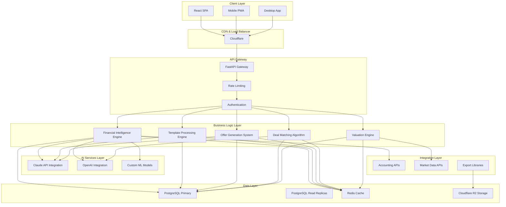

# Irresistible M&A SaaS Platform Infrastructure Architecture Document

**Project:** M&A SaaS Platform
**Date:** 2025-01-12
**Author:** BMad User

## Executive Summary

This document outlines the comprehensive infrastructure architecture for the world's most irresistible M&A SaaS platform. The architecture is designed to deliver sub-30-second financial analysis, support 1,000+ concurrent users, and achieve 99.9% uptime while maintaining enterprise-grade security and compliance.

The platform combines real-time financial intelligence, AI-powered insights, professional document generation, and sophisticated deal modeling into a single integrated experience that makes 90%+ trial users convert to paid subscriptions.

## 1. Technology Stack and Decisions

### 1.1 Technology and Library Decision Table

| Component              | Technology Choice            | Rationale                                                         | Alternatives Considered             |
| ---------------------- | ---------------------------- | ----------------------------------------------------------------- | ----------------------------------- |
| **Backend Framework**  | FastAPI (Python 3.11+)       | High performance, automatic OpenAPI docs, excellent async support | Django REST, Flask, Node.js Express |
| **Frontend Framework** | React 18 + TypeScript        | Large ecosystem, excellent developer experience, strong typing    | Vue.js, Angular, Svelte             |
| **Database**           | PostgreSQL 15+               | ACID compliance, JSON support, excellent performance              | MySQL, MongoDB, CockroachDB         |
| **Vector Database**    | pgvector extension           | Integrated with PostgreSQL, excellent for AI embeddings           | Pinecone, Weaviate, Chroma          |
| **Cache Layer**        | Redis 7+                     | High performance, pub/sub support, data structures                | Memcached, Apache Ignite            |
| **File Storage**       | Cloudflare R2                | S3-compatible, global CDN, cost-effective                         | AWS S3, Google Cloud Storage        |
| **Authentication**     | Clerk                        | Modern auth platform, excellent developer experience              | Auth0, Firebase Auth, Supabase Auth |
| **AI Services**        | Anthropic Claude + OpenAI    | Best-in-class reasoning, function calling                         | Google Vertex AI, Azure OpenAI      |
| **Message Queue**      | Redis Streams                | Integrated with cache, excellent performance                      | RabbitMQ, Apache Kafka              |
| **Container Platform** | Docker + Kubernetes          | Industry standard, excellent scaling                              | Docker Swarm, Nomad                 |
| **Cloud Provider**     | Multi-cloud (Render primary) | Simplified deployment, global presence                            | AWS, Google Cloud, Azure            |
| **Monitoring**         | Grafana + Prometheus         | Open source, excellent observability                              | New Relic, DataDog                  |
| **CI/CD**              | GitHub Actions               | Integrated with code repository                                   | GitLab CI, Jenkins                  |

## 2. Architecture Overview



## 3. Data Architecture

### 3.1 Database Schema Design

**Core Tables:**

- `organizations` - Multi-tenant organization data
- `users` - User profiles and preferences
- `deals` - M&A opportunity tracking
- `financial_data` - Real-time financial metrics
- `templates` - Document template library
- `generated_documents` - Document generation history
- `valuations` - Valuation analysis results
- `deal_matches` - AI-powered match results

**Partitioning Strategy:**

- Horizontal partitioning by organization_id for tenant isolation
- Time-based partitioning for financial_data and audit logs
- Geographic partitioning for compliance requirements

### 3.2 Data Flow Architecture

```
┌─────────────────────────────────────────────────────────────────┐
│                     DATA FLOW PIPELINE                         │
├─────────────────────────────────────────────────────────────────┤
│  Ingestion Layer                                               │
│  ├── Accounting API Connectors (Xero, QuickBooks, etc.)       │
│  ├── Market Data Feeds (Bloomberg, Refinitiv)                 │
│  ├── User Input Validation                                    │
│  └── File Upload Processing                                   │
├─────────────────────────────────────────────────────────────────┤
│  Processing Layer                                              │
│  ├── Real-time Data Validation                               │
│  ├── Financial Ratio Calculations                            │
│  ├── AI Model Inference                                      │
│  └── Template Rendering Engine                               │
├─────────────────────────────────────────────────────────────────┤
│  Storage Layer                                                │
│  ├── PostgreSQL (Structured Data)                           │
│  ├── Redis (Cache & Sessions)                               │
│  ├── R2 (Documents & Exports)                               │
│  └── Vector Store (AI Embeddings)                           │
├─────────────────────────────────────────────────────────────────┤
│  Analytics Layer                                              │
│  ├── Usage Metrics Collection                               │
│  ├── Performance Monitoring                                  │
│  ├── Business Intelligence                                   │
│  └── Audit Log Processing                                    │
└─────────────────────────────────────────────────────────────────┘
```

## 4. Component and Integration Overview

### 4.1 Microservices Architecture

**Core Services:**

1. **API Gateway Service** - Request routing, authentication, rate limiting
2. **Financial Intelligence Service** - Real-time financial analysis
3. **Template Service** - Document generation and management
4. **Valuation Service** - Multi-methodology valuations
5. **Matching Service** - AI-powered deal matching
6. **Export Service** - Professional document exports
7. **Notification Service** - Real-time updates and alerts
8. **Analytics Service** - Usage tracking and business intelligence

### 4.2 Integration Points

**External Integrations:**

- **Accounting Systems**: OAuth2-based connections to Xero, QuickBooks, Sage, NetSuite
- **Market Data**: REST/WebSocket APIs for real-time financial data
- **AI Services**: HTTP APIs with fallback mechanisms
- **Email/SMS**: Transactional messaging via SendGrid/Twilio
- **Payment Processing**: Stripe for subscription billing

**Internal Integrations:**

- **Message Queues**: Redis Streams for async processing
- **Event Sourcing**: Audit trail and state reconstruction
- **Service Mesh**: Istio for service-to-service communication
- **API Versioning**: Semantic versioning with backward compatibility

## 5. Architecture Decision Records

### ADR-001: Multi-Tenant Architecture Strategy

**Decision**: Shared database with tenant isolation via organization_id
**Rationale**: Balance between resource efficiency and data isolation
**Consequences**: Requires careful query filtering and row-level security

### ADR-002: AI Service Integration Pattern

**Decision**: External API calls with circuit breakers and fallbacks
**Rationale**: Leverage best-in-class AI without vendor lock-in
**Consequences**: Network dependency requires robust error handling

### ADR-003: Real-Time Data Synchronization

**Decision**: Event-driven architecture with eventual consistency
**Rationale**: Performance and scalability over strict consistency
**Consequences**: Requires conflict resolution strategies

### ADR-004: File Storage Strategy

**Decision**: Cloudflare R2 for global document distribution
**Rationale**: Cost-effective with built-in CDN capabilities
**Consequences**: S3 compatibility but vendor-specific optimizations

### ADR-005: Authentication and Authorization

**Decision**: Clerk for authentication, custom RBAC for authorization
**Rationale**: Developer experience and security best practices
**Consequences**: Dependency on external service for critical path

## 6. Implementation Guidance

### 6.1 Development Phases

**Phase 1: Core Infrastructure (Weeks 1-2)**

- Set up PostgreSQL with multi-tenancy
- Implement authentication and API gateway
- Create basic CI/CD pipeline
- Deploy monitoring and logging

**Phase 2: Business Logic (Weeks 3-6)**

- Implement financial intelligence engine
- Build template processing system
- Create valuation calculation engine
- Develop deal matching algorithm

**Phase 3: Integration & Polish (Weeks 7-8)**

- External API integrations
- Performance optimization
- Security hardening
- Load testing and tuning

### 6.2 Development Best Practices

- **Code Quality**: Type hints, docstrings, comprehensive tests
- **Security**: Input validation, SQL injection prevention, secret management
- **Performance**: Database indexing, query optimization, caching strategies
- **Monitoring**: Structured logging, metrics collection, error tracking
- **Documentation**: API docs, deployment guides, runbooks

## 7. Proposed Source Tree

```
ma-saas-platform/
├── backend/
│   ├── app/
│   │   ├── api/
│   │   │   ├── v1/
│   │   │   │   ├── financial_intelligence.py
│   │   │   │   ├── templates.py
│   │   │   │   ├── valuations.py
│   │   │   │   ├── deal_matching.py
│   │   │   │   └── exports.py
│   │   │   └── deps.py
│   │   ├── services/
│   │   │   ├── financial_intelligence.py
│   │   │   ├── template_engine.py
│   │   │   ├── automated_valuation_engine.py
│   │   │   ├── intelligent_deal_matching.py
│   │   │   ├── offer_stack_generator.py
│   │   │   └── claude_service.py
│   │   ├── integrations/
│   │   │   ├── accounting_connectors.py
│   │   │   ├── market_data_apis.py
│   │   │   └── export_libraries.py
│   │   ├── models/
│   │   │   ├── financial_models.py
│   │   │   ├── documents.py
│   │   │   ├── valuations.py
│   │   │   └── deal_matches.py
│   │   ├── auth/
│   │   │   ├── clerk_auth.py
│   │   │   └── tenant_isolation.py
│   │   ├── core/
│   │   │   ├── config.py
│   │   │   ├── database.py
│   │   │   └── security.py
│   │   └── main.py
│   ├── tests/
│   ├── alembic/
│   ├── requirements.txt
│   └── Dockerfile
├── frontend/
│   ├── src/
│   │   ├── components/
│   │   │   ├── financial-analysis/
│   │   │   ├── template-generator/
│   │   │   ├── offer-builder/
│   │   │   ├── deal-matching/
│   │   │   └── valuation-dashboard/
│   │   ├── services/
│   │   ├── hooks/
│   │   ├── types/
│   │   └── utils/
│   ├── public/
│   ├── package.json
│   └── Dockerfile
├── infrastructure/
│   ├── kubernetes/
│   ├── terraform/
│   ├── docker-compose.yml
│   └── nginx.conf
├── docs/
│   ├── api/
│   ├── deployment/
│   └── user-guides/
└── scripts/
    ├── setup.sh
    ├── deploy.sh
    └── backup.sh
```

## 8. Testing Strategy

### 8.1 Testing Pyramid

**Unit Tests (70%)**

- Business logic validation
- Individual service testing
- Mock external dependencies
- Target: >90% code coverage

**Integration Tests (20%)**

- Database interactions
- API endpoint testing
- Service-to-service communication
- External API integration

**End-to-End Tests (10%)**

- Critical user journeys
- Cross-browser compatibility
- Performance benchmarks
- Security penetration testing

### 8.2 Testing Specialist Recommendations

**Performance Testing:**

- Load testing with 1,000+ concurrent users
- Financial analysis response time <30 seconds
- Document generation <60 seconds
- Database query optimization

**Security Testing:**

- OWASP Top 10 vulnerability scanning
- Penetration testing for financial data
- SQL injection and XSS prevention
- Authentication bypass testing

## 9. Deployment and Operations

### 9.1 Deployment Architecture

**Production Environment:**

- Multi-region deployment for global availability
- Auto-scaling based on CPU and memory usage
- Blue-green deployment for zero-downtime updates
- Automated rollback on deployment failures

**Staging Environment:**

- Production-like environment for testing
- Automated deployments on feature branches
- Load testing and security scanning
- User acceptance testing

**Development Environment:**

- Local Docker Compose setup
- Hot reloading for rapid development
- Seeded test data for consistent testing
- Integration with external service mocks

### 9.2 DevOps Specialist Recommendations

**Infrastructure as Code:**

- Terraform for cloud resource provisioning
- Kubernetes YAML for application deployment
- Helm charts for environment-specific configuration
- GitOps workflow with ArgoCD

**Monitoring and Alerting:**

- Application performance monitoring (APM)
- Business metrics dashboards
- Error rate and latency alerting
- Capacity planning and forecasting

**Backup and Disaster Recovery:**

- Automated daily database backups
- Point-in-time recovery capabilities
- Multi-region data replication
- Disaster recovery runbooks and testing

## 10. Security

### 10.1 Security Architecture

**Defense in Depth:**

- Network security with VPCs and firewalls
- Application security with input validation
- Data security with encryption at rest and in transit
- Identity security with multi-factor authentication

**Data Protection:**

- End-to-end encryption for financial data
- PII anonymization in non-production environments
- Secure secret management with HashiCorp Vault
- Regular security audits and compliance checks

**Compliance Requirements:**

- SOC 2 Type II certification
- GDPR compliance with data residency
- Financial data protection regulations
- Audit trail and data retention policies

### 10.2 Security Specialist Recommendations

**Threat Modeling:**

- STRIDE analysis for critical components
- Attack surface minimization
- Security code review process
- Vulnerability management program

**Access Control:**

- Zero-trust security model
- Role-based access control (RBAC)
- Principle of least privilege
- Regular access reviews and rotation

---

## Specialist Sections Summary

This infrastructure architecture incorporates recommendations from testing, DevOps, and security specialists to ensure a robust, scalable, and secure platform. The multi-layered approach addresses performance, reliability, and compliance requirements while maintaining developer productivity and operational efficiency.

The architecture supports the platform's goal of achieving 90%+ trial-to-paid conversion through reliable, fast, and secure service delivery that builds user trust and confidence.

---

_Generated using BMad Method Solution Architecture workflow_
