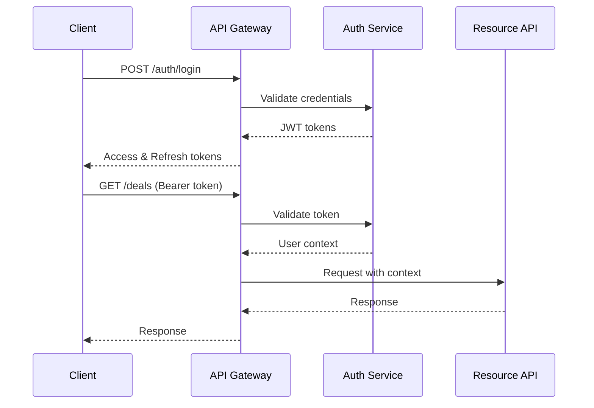

# M&A Platform - API Specifications v2.0

**BMAD Phase:** Phase 2 Core Features
**Specification Type:** RESTful + GraphQL + WebSocket
**OpenAPI Version:** 3.0.3
**Last Updated:** 2025-10-11

---

## API Architecture Overview

### Design Principles

```yaml
Architecture Pattern: API Gateway + Microservices
Protocol: HTTPS only (TLS 1.3+)
Format: JSON (application/json)
Versioning: URL-based (/v1, /v2)
Authentication: JWT Bearer tokens
Rate Limiting: Token bucket algorithm
Pagination: Cursor-based
Caching: ETags + Cache-Control headers
```

### Service Endpoints

```yaml
Gateway: https://api.maplatform.com
Services:
  Core API: /v1/core
  AI Service: /v1/ai
  Document Service: /v1/documents
  Analytics Service: /v1/analytics
  WebSocket: wss://ws.maplatform.com
  GraphQL: /graphql
```

---

## Core API Endpoints

### Authentication & Authorization

```yaml
POST /v1/auth/login:
  summary: Authenticate user
  request:
    body:
      email: string
      password: string
      tenant?: string
  response:
    200:
      access_token: string
      refresh_token: string
      expires_in: number
      user: UserProfile
  security: public

POST /v1/auth/refresh:
  summary: Refresh access token
  request:
    body:
      refresh_token: string
  response:
    200:
      access_token: string
      expires_in: number

POST /v1/auth/logout:
  summary: Invalidate tokens
  security: bearer

GET /v1/auth/permissions:
  summary: Get user permissions
  response:
    200:
      permissions: string[]
      roles: Role[]
      tenant: TenantInfo
```

### Deal Management API

```typescript
// TypeScript interfaces for strong typing
interface DealEndpoints {
  // CRUD Operations
  'POST /v1/deals': {
    request: CreateDealRequest;
    response: Deal;
  };

  'GET /v1/deals': {
    query: {
      stage?: DealStage;
      minValue?: number;
      maxValue?: number;
      search?: string;
      sort?: 'value' | 'created' | 'updated' | 'closing';
      cursor?: string;
      limit?: number; // max 100
    };
    response: PaginatedResponse<Deal>;
  };

  'GET /v1/deals/:id': {
    params: { id: UUID };
    query: {
      include?: ('activities' | 'documents' | 'team' | 'ai_analysis')[];
    };
    response: DealDetail;
  };

  'PATCH /v1/deals/:id': {
    params: { id: UUID };
    request: Partial<Deal>;
    response: Deal;
  };

  'DELETE /v1/deals/:id': {
    params: { id: UUID };
    response: { deleted: boolean };
  };

  // Bulk Operations
  'POST /v1/deals/bulk': {
    request: {
      operation: 'create' | 'update' | 'delete' | 'archive';
      deals?: CreateDealRequest[];
      dealIds?: UUID[];
      updates?: Partial<Deal>;
    };
    response: BulkOperationResult;
  };

  // Pipeline Operations
  'PUT /v1/deals/:id/stage': {
    params: { id: UUID };
    request: {
      stage: DealStage;
      reason?: string;
      probability?: number;
    };
    response: Deal;
  };

  // Team Management
  'POST /v1/deals/:id/team': {
    params: { id: UUID };
    request: {
      userId: UUID;
      role: 'lead' | 'member' | 'observer';
      permissions?: string[];
    };
    response: TeamMember;
  };
}

// Request/Response Types
interface CreateDealRequest {
  name: string;
  stage: DealStage;
  value?: number;
  currency?: Currency;
  probability?: number;
  expectedCloseDate?: Date;
  description?: string;
  customFields?: Record<string, any>;
  tags?: string[];
}

interface Deal {
  id: UUID;
  tenant_id: UUID;
  name: string;
  stage: DealStage;
  value: number;
  currency: Currency;
  probability: number;
  expectedCloseDate: Date;
  assignedTo: UUID;
  team: TeamMember[];
  customFields: Record<string, any>;
  tags: string[];
  aiScore?: number;
  aiInsights?: AIInsight[];
  createdBy: UUID;
  createdAt: Date;
  updatedAt: Date;
  version: number; // Optimistic locking
}

interface PaginatedResponse<T> {
  data: T[];
  pagination: {
    cursor?: string;
    hasNext: boolean;
    hasPrev: boolean;
    total?: number;
  };
  meta?: {
    executionTime: number;
    cached: boolean;
  };
}
```

### Activity & Task Management

```yaml
POST /v1/activities:
  summary: Log activity
  request:
    dealId: UUID
    type: email | call | meeting | note | task
    title: string
    description?: string
    startTime?: DateTime
    duration?: number
    participants?: UUID[]
    attachments?: UUID[]
  response: Activity

GET /v1/activities:
  summary: List activities
  query:
    dealId?: UUID
    userId?: UUID
    type?: ActivityType
    dateFrom?: Date
    dateTo?: Date
    cursor?: string
  response: PaginatedResponse<Activity>

POST /v1/tasks:
  summary: Create task
  request:
    title: string
    description?: string
    dealId?: UUID
    assignedTo: UUID
    dueDate: DateTime
    priority: low | medium | high | critical
    dependencies?: UUID[]
  response: Task

PATCH /v1/tasks/:id:
  summary: Update task
  params:
    id: UUID
  request:
    status?: pending | in_progress | completed | cancelled
    completedAt?: DateTime
    completedBy?: UUID
  response: Task

GET /v1/tasks:
  summary: List tasks
  query:
    assignedTo?: UUID
    dealId?: UUID
    status?: TaskStatus
    dueBefore?: DateTime
    overdue?: boolean
  response: PaginatedResponse<Task>
```

---

## AI Service API

### Valuation Endpoints

```typescript
interface ValuationAPI {
  'POST /v1/ai/valuation': {
    request: {
      dealId: UUID;
      method: ValuationMethod;
      financials: FinancialData;
      assumptions?: ValuationAssumptions;
      comparables?: UUID[]; // Other deal IDs
    };
    response: {
      id: UUID;
      valuation: {
        baseCase: number;
        range: { low: number; high: number };
        confidence: number; // 0-100
      };
      methodology: {
        method: ValuationMethod;
        calculations: any; // Method-specific
        assumptions: ValuationAssumptions;
      };
      sensitivity: SensitivityAnalysis;
      report: {
        summary: string;
        details: string;
        charts: ChartData[];
      };
    };
  };

  'POST /v1/ai/valuation/compare': {
    request: {
      dealIds: UUID[];
      method: ValuationMethod;
    };
    response: {
      comparisons: ValuationComparison[];
      insights: string[];
      recommendations: string[];
    };
  };
}

type ValuationMethod = 'dcf' | 'multiples' | 'precedent' | 'asset_based' | 'venture_capital';

interface FinancialData {
  revenue: TimeSeriesData;
  ebitda: TimeSeriesData;
  netIncome: TimeSeriesData;
  assets: BalanceSheetData;
  liabilities: BalanceSheetData;
  cashFlow: CashFlowData;
}

interface ValuationAssumptions {
  discountRate?: number;
  growthRate?: number;
  terminalMultiple?: number;
  marketMultiples?: Record<string, number>;
  custom?: Record<string, any>;
}
```

### Risk Assessment API

```yaml
POST /v1/ai/risk/assess:
  summary: Comprehensive risk assessment
  request:
    dealId: UUID
    includeDocuments: boolean
    riskCategories?: string[]
    depth: basic | detailed | comprehensive
  response:
    overallRisk:
      score: number # 0-100
      rating: low | medium | high | critical
    categories:
      financial:
        score: number
        factors: RiskFactor[]
      operational:
        score: number
        factors: RiskFactor[]
      legal:
        score: number
        factors: RiskFactor[]
      market:
        score: number
        factors: RiskFactor[]
      reputational:
        score: number
        factors: RiskFactor[]
    redFlags: RedFlag[]
    mitigations: Mitigation[]
    confidence: number

POST /v1/ai/risk/monitor:
  summary: Set up risk monitoring
  request:
    dealId: UUID
    thresholds:
      financial: number
      operational: number
      overall: number
    alertChannels: string[]
  response:
    monitorId: UUID
    status: active
    nextCheck: DateTime
```

### Document Intelligence API

```typescript
interface DocumentIntelligenceAPI {
  'POST /v1/ai/documents/analyze': {
    request: {
      documentId: UUID;
      analysisType: AnalysisType[];
      extractFields?: string[];
      compareWith?: UUID[]; // Other doc IDs
    };
    response: {
      summary: string;
      keyTerms: Term[];
      entities: Entity[];
      risks: DocumentRisk[];
      obligations: Obligation[];
      customFields?: Record<string, any>;
    };
  };

  'POST /v1/ai/documents/query': {
    request: {
      documentIds: UUID[];
      query: string;
      maxResults?: number;
    };
    response: {
      answers: Answer[];
      confidence: number;
      sources: Source[];
    };
  };

  'POST /v1/ai/documents/compare': {
    request: {
      baseDocument: UUID;
      compareDocuments: UUID[];
      focusAreas?: string[];
    };
    response: {
      differences: Difference[];
      similarities: Similarity[];
      recommendations: string[];
    };
  };
}

type AnalysisType =
  | 'summary'
  | 'key_terms'
  | 'risks'
  | 'obligations'
  | 'entities'
  | 'financial_extraction';
```

---

## GraphQL Schema

```graphql
# GraphQL for complex queries
type Query {
  # Deal queries with deep relations
  deal(id: ID!): Deal
  deals(filter: DealFilter, sort: DealSort, pagination: PaginationInput): DealConnection!

  # Pipeline analytics
  pipelineAnalytics(dateRange: DateRangeInput!, groupBy: GroupBy): PipelineAnalytics!

  # AI insights
  aiInsights(dealId: ID!): AIInsights

  # Search across all entities
  search(query: String!, types: [SearchType!], limit: Int): SearchResults!
}

type Mutation {
  # Deal mutations
  createDeal(input: CreateDealInput!): Deal!
  updateDeal(id: ID!, input: UpdateDealInput!): Deal!
  moveDealStage(id: ID!, stage: DealStage!): Deal!

  # Bulk operations
  bulkUpdateDeals(ids: [ID!]!, update: UpdateDealInput!): BulkUpdateResult!

  # AI operations
  requestValuation(dealId: ID!, method: ValuationMethod!): ValuationJob!
}

type Subscription {
  # Real-time deal updates
  dealUpdated(dealId: ID!): Deal!

  # Pipeline changes
  pipelineChanged(userId: ID): PipelineChange!

  # AI job updates
  aiJobProgress(jobId: ID!): AIJobProgress!

  # Notifications
  userNotifications(userId: ID!): Notification!
}

# Complex types
type Deal {
  id: ID!
  name: String!
  stage: DealStage!
  value: Float
  probability: Int
  expectedCloseDate: DateTime

  # Relations
  activities(first: Int, after: String, filter: ActivityFilter): ActivityConnection!

  documents(first: Int, after: String, type: DocumentType): DocumentConnection!

  team: [TeamMember!]!

  # AI fields
  aiScore: Float
  aiInsights: [AIInsight!]
  valuation: Valuation
  riskAssessment: RiskAssessment
}

# Connections for pagination
type DealConnection {
  edges: [DealEdge!]!
  pageInfo: PageInfo!
  totalCount: Int!
  analytics: ConnectionAnalytics
}

type DealEdge {
  node: Deal!
  cursor: String!
}

type PageInfo {
  hasNextPage: Boolean!
  hasPreviousPage: Boolean!
  startCursor: String
  endCursor: String
}
```

---

## WebSocket Events

### Connection Management

```typescript
// WebSocket connection protocol
interface WebSocketProtocol {
  // Client -> Server
  connect: {
    token: string;
    subscriptions: string[];
  };

  subscribe: {
    channel: string;
    filters?: Record<string, any>;
  };

  unsubscribe: {
    channel: string;
  };

  ping: {
    timestamp: number;
  };

  // Server -> Client
  connected: {
    sessionId: string;
    userId: string;
    permissions: string[];
  };

  subscribed: {
    channel: string;
    subscriptionId: string;
  };

  pong: {
    timestamp: number;
  };

  error: {
    code: string;
    message: string;
    details?: any;
  };
}
```

### Real-time Events

```yaml
# Deal events
deal.created:
  data:
    deal: Deal
    createdBy: User

deal.updated:
  data:
    deal: Deal
    changes: FieldChange[]
    updatedBy: User

deal.stage_changed:
  data:
    dealId: UUID
    fromStage: DealStage
    toStage: DealStage
    movedBy: User

# Collaboration events
collaboration.user_joined:
  data:
    userId: UUID
    resource: ResourceRef
    presence: PresenceData

collaboration.cursor_moved:
  data:
    userId: UUID
    cursor: CursorPosition
    selection?: Selection

collaboration.content_changed:
  data:
    userId: UUID
    documentId: UUID
    operations: Operation[]

# AI events
ai.analysis_started:
  data:
    jobId: UUID
    type: AnalysisType
    dealId: UUID

ai.analysis_progress:
  data:
    jobId: UUID
    progress: number # 0-100
    stage: string

ai.analysis_completed:
  data:
    jobId: UUID
    resultId: UUID
    summary: string

# Notification events
notification.created:
  data:
    notification: Notification
    priority: Priority
```

---

## Error Handling

### Error Response Format

```json
{
  "error": {
    "code": "DEAL_NOT_FOUND",
    "message": "The requested deal does not exist",
    "details": {
      "dealId": "123e4567-e89b-12d3-a456-426614174000"
    },
    "timestamp": "2025-01-15T10:30:00Z",
    "requestId": "req_abc123",
    "documentation": "https://docs.maplatform.com/errors/DEAL_NOT_FOUND"
  }
}
```

### Error Codes

```yaml
# Authentication & Authorization
AUTH_INVALID_CREDENTIALS: Invalid email or password
AUTH_TOKEN_EXPIRED: Access token has expired
AUTH_INSUFFICIENT_PERMISSIONS: User lacks required permissions
AUTH_TENANT_MISMATCH: User not authorized for this tenant

# Validation
VALIDATION_REQUIRED_FIELD: Required field missing
VALIDATION_INVALID_FORMAT: Field format is invalid
VALIDATION_OUT_OF_RANGE: Value outside acceptable range

# Business Logic
DEAL_INVALID_STAGE_TRANSITION: Cannot move to specified stage
DEAL_DUPLICATE_NAME: Deal name already exists
DEAL_TEAM_MEMBER_EXISTS: User already on deal team

# AI Service
AI_QUOTA_EXCEEDED: AI processing quota exceeded
AI_ANALYSIS_FAILED: AI analysis could not be completed
AI_INSUFFICIENT_DATA: Not enough data for analysis

# System
RATE_LIMIT_EXCEEDED: Too many requests
SERVICE_UNAVAILABLE: Service temporarily unavailable
INTERNAL_ERROR: An unexpected error occurred
```

---

## Rate Limiting

### Rate Limit Strategy

```yaml
Default Limits:
  Anonymous: 10 requests/minute
  Authenticated: 100 requests/minute
  Premium: 1000 requests/minute
  Enterprise: 10000 requests/minute

Endpoint-Specific:
  AI Analysis: 10 requests/hour
  Bulk Operations: 5 requests/minute
  Export: 10 requests/hour
  Search: 30 requests/minute

Headers:
  X-RateLimit-Limit: 1000
  X-RateLimit-Remaining: 456
  X-RateLimit-Reset: 1642082400
  Retry-After: 120 # When rate limited

Response (429):
  error:
    code: RATE_LIMIT_EXCEEDED
    message: Rate limit exceeded
    details:
      limit: 1000
      window: 60
      retryAfter: 45
```

---

## Caching Strategy

### Cache Headers

```yaml
# Cache control by endpoint type
Static Data:
  Cache-Control: public, max-age=3600
  ETag: 'abc123'

User Data:
  Cache-Control: private, max-age=300
  ETag: 'user123'

Real-time Data:
  Cache-Control: no-cache

Conditional Requests:
  If-None-Match: 'abc123'
  If-Modified-Since: Wed, 21 Oct 2023 07:28:00 GMT
```

### Cache Invalidation

```typescript
// Cache invalidation events
interface CacheInvalidation {
  // Patterns for cache key invalidation
  patterns: {
    dealUpdate: `deal:${dealId}:*`;
    userUpdate: `user:${userId}:*`;
    tenantUpdate: `tenant:${tenantId}:*`;
  };

  // Cascade invalidation
  cascade: {
    deal: ['pipeline', 'analytics', 'team'];
    document: ['deal', 'search'];
    user: ['permissions', 'deals', 'tasks'];
  };
}
```

---

## API Versioning

### Version Migration

```yaml
Deprecation Policy:
  Notice Period: 6 months
  Migration Guide: Provided
  Sunset Period: 3 months after notice

Version Headers:
  API-Version: 2.0.0
  API-Deprecated: true # If using deprecated version
  API-Sunset-Date: 2025-12-31

Version Differences:
  /v1/deals:
    - Simple response format
    - Limited filtering

  /v2/deals:
    - Rich response with relations
    - Advanced filtering
    - GraphQL support
```

---

## Security

### Authentication Flow



### API Security Headers

```yaml
Required Headers:
  X-Request-ID: UUID for request tracing
  X-Tenant-ID: Tenant identifier
  X-API-Key: API key for service auth

Security Headers (Response):
  X-Content-Type-Options: nosniff
  X-Frame-Options: DENY
  X-XSS-Protection: 1; mode=block
  Strict-Transport-Security: max-age=31536000
  Content-Security-Policy: default-src 'self'
```

---

## Performance SLOs

### Service Level Objectives

```yaml
Availability: 99.9% uptime
Latency P50: <100ms
Latency P95: <200ms
Latency P99: <500ms

Endpoint-Specific SLOs:
  GET /deals: <150ms P95
  POST /ai/valuation: <5000ms P95
  WebSocket latency: <50ms P95
  GraphQL queries: <300ms P95

Error Budget:
  5xx errors: <0.1%
  4xx errors: <5%
  Timeout rate: <0.5%
```

---

_This API specification follows OpenAPI 3.0.3 standards and provides comprehensive documentation for Phase 2 implementation. All endpoints support maintainable, scalable patterns with clear versioning and deprecation policies._
