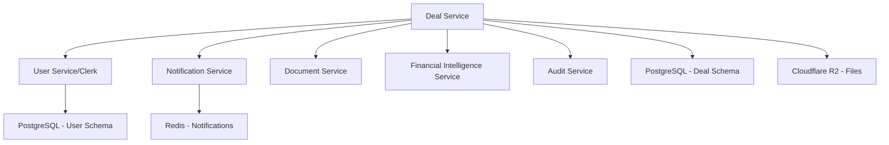

# Epic 1: Core Deal Management Platform - Technical Specification

**Epic**: Core Deal Management Platform
**Priority**: MUST HAVE - Quarter 1
**Dependencies**: None (Foundation Epic)
**Estimated Effort**: 4 weeks

## Overview

Establish foundational deal pipeline and workflow management capabilities that serve as the backbone for all M&A activities. This epic delivers the essential deal management foundation that integrates with Financial Intelligence, Template Engine, and Deal Matching services.

## Technical Architecture

### Service Dependencies



### Database Schema Design

```sql
-- Core deal management tables
CREATE SCHEMA deal_management;

-- Deal pipeline stages (customizable per tenant)
CREATE TABLE deal_management.pipeline_stages (
    id UUID PRIMARY KEY DEFAULT gen_random_uuid(),
    tenant_id UUID NOT NULL,
    stage_name VARCHAR(100) NOT NULL,
    stage_order INTEGER NOT NULL,
    stage_color VARCHAR(7) DEFAULT '#3B82F6',
    is_active BOOLEAN DEFAULT true,
    created_at TIMESTAMP WITH TIME ZONE DEFAULT NOW(),

    UNIQUE(tenant_id, stage_name),
    UNIQUE(tenant_id, stage_order)
);

-- Main deals table with comprehensive metadata
CREATE TABLE deal_management.deals (
    id UUID PRIMARY KEY DEFAULT gen_random_uuid(),
    tenant_id UUID NOT NULL,
    deal_name VARCHAR(255) NOT NULL,
    deal_code VARCHAR(50), -- Auto-generated: DL-2024-001

    -- Deal classification
    deal_type VARCHAR(50) NOT NULL CHECK (deal_type IN ('acquisition', 'disposal', 'merger', 'ipo', 'fundraising')),
    deal_side VARCHAR(20) NOT NULL CHECK (deal_side IN ('buy_side', 'sell_side', 'both')),
    industry_sector VARCHAR(100),
    geography VARCHAR(100),

    -- Financial metrics
    enterprise_value DECIMAL(15,2),
    revenue_ltm DECIMAL(15,2),
    ebitda_ltm DECIMAL(15,2),
    currency VARCHAR(3) DEFAULT 'GBP',

    -- Pipeline management
    current_stage_id UUID REFERENCES deal_management.pipeline_stages(id),
    probability_percent INTEGER DEFAULT 50 CHECK (probability_percent >= 0 AND probability_percent <= 100),
    expected_close_date DATE,
    actual_close_date DATE,

    -- Key participants
    target_company_name VARCHAR(255),
    buyer_name VARCHAR(255),
    seller_name VARCHAR(255),
    advisor_name VARCHAR(255),
    deal_lead_user_id UUID, -- References users table

    -- Deal scoring and AI insights
    deal_score DECIMAL(3,2) DEFAULT 0.0, -- 0-10 AI-calculated score
    confidence_level DECIMAL(3,2) DEFAULT 0.5, -- 0-1 confidence
    ai_insights JSONB DEFAULT '{}',
    risk_factors TEXT[],

    -- Metadata
    description TEXT,
    custom_fields JSONB DEFAULT '{}',
    tags TEXT[],

    -- Status tracking
    status VARCHAR(20) DEFAULT 'active' CHECK (status IN ('active', 'on_hold', 'completed', 'cancelled')),
    is_confidential BOOLEAN DEFAULT true,

    -- Audit fields
    created_at TIMESTAMP WITH TIME ZONE DEFAULT NOW(),
    updated_at TIMESTAMP WITH TIME ZONE DEFAULT NOW(),
    created_by UUID NOT NULL,
    updated_by UUID,

    -- Indexes for performance
    INDEX idx_deals_tenant_status (tenant_id, status),
    INDEX idx_deals_stage (current_stage_id),
    INDEX idx_deals_close_date (expected_close_date),
    INDEX idx_deals_enterprise_value (enterprise_value DESC),
    INDEX idx_deals_lead (deal_lead_user_id),
    INDEX idx_deals_text_search USING gin(to_tsvector('english', deal_name || ' ' || COALESCE(description, '')))
);

-- Deal activities and timeline
CREATE TABLE deal_management.deal_activities (
    id UUID PRIMARY KEY DEFAULT gen_random_uuid(),
    tenant_id UUID NOT NULL,
    deal_id UUID NOT NULL REFERENCES deal_management.deals(id) ON DELETE CASCADE,

    -- Activity classification
    activity_type VARCHAR(50) NOT NULL CHECK (activity_type IN (
        'call', 'meeting', 'email', 'note', 'task', 'milestone',
        'document_upload', 'stage_change', 'valuation', 'offer_sent', 'dd_request'
    )),
    activity_subtype VARCHAR(50), -- E.g., 'management_presentation', 'due_diligence_call'

    -- Activity content
    title VARCHAR(255) NOT NULL,
    description TEXT,
    outcome TEXT,

    -- Participants
    participants JSONB DEFAULT '[]', -- Array of user/contact objects
    lead_participant_id UUID, -- Primary person responsible

    -- Scheduling and completion
    scheduled_at TIMESTAMP WITH TIME ZONE,
    completed_at TIMESTAMP WITH TIME ZONE,
    duration_minutes INTEGER,

    -- Follow-up and tasks
    requires_follow_up BOOLEAN DEFAULT false,
    follow_up_date DATE,
    follow_up_assigned_to UUID,

    -- Integration metadata
    external_id VARCHAR(255), -- For calendar/email integration
    external_source VARCHAR(50), -- 'outlook', 'gmail', 'salesforce'

    -- Audit and status
    status VARCHAR(20) DEFAULT 'completed' CHECK (status IN ('scheduled', 'in_progress', 'completed', 'cancelled')),
    created_at TIMESTAMP WITH TIME ZONE DEFAULT NOW(),
    created_by UUID NOT NULL,

    INDEX idx_activities_deal (deal_id, created_at DESC),
    INDEX idx_activities_user (lead_participant_id, scheduled_at),
    INDEX idx_activities_type (activity_type, completed_at),
    INDEX idx_activities_follow_up (follow_up_date, requires_follow_up)
);

-- Deal contacts and relationships
CREATE TABLE deal_management.deal_contacts (
    id UUID PRIMARY KEY DEFAULT gen_random_uuid(),
    tenant_id UUID NOT NULL,
    deal_id UUID NOT NULL REFERENCES deal_management.deals(id) ON DELETE CASCADE,

    -- Contact information
    contact_name VARCHAR(255) NOT NULL,
    contact_title VARCHAR(100),
    company_name VARCHAR(255),
    email VARCHAR(255),
    phone VARCHAR(50),

    -- Contact role in deal
    contact_role VARCHAR(50) NOT NULL CHECK (contact_role IN (
        'decision_maker', 'influencer', 'advisor', 'legal_counsel',
        'accountant', 'banker', 'management', 'board_member', 'other'
    )),
    contact_side VARCHAR(20) CHECK (contact_side IN ('buyer', 'seller', 'advisor', 'service_provider')),

    -- Relationship management
    relationship_strength INTEGER DEFAULT 3 CHECK (relationship_strength >= 1 AND relationship_strength <= 5),
    last_contact_date DATE,
    next_contact_date DATE,
    preferred_contact_method VARCHAR(20) DEFAULT 'email',

    -- Contact metadata
    notes TEXT,
    linkedin_url VARCHAR(500),
    is_primary_contact BOOLEAN DEFAULT false,

    -- Audit fields
    created_at TIMESTAMP WITH TIME ZONE DEFAULT NOW(),
    created_by UUID NOT NULL,

    INDEX idx_contacts_deal (deal_id, contact_role),
    INDEX idx_contacts_company (company_name),
    INDEX idx_contacts_next_contact (next_contact_date)
);

-- Deal tasks and milestones
CREATE TABLE deal_management.deal_tasks (
    id UUID PRIMARY KEY DEFAULT gen_random_uuid(),
    tenant_id UUID NOT NULL,
    deal_id UUID NOT NULL REFERENCES deal_management.deals(id) ON DELETE CASCADE,

    -- Task details
    task_title VARCHAR(255) NOT NULL,
    task_description TEXT,
    task_type VARCHAR(50) DEFAULT 'general' CHECK (task_type IN (
        'due_diligence', 'legal_review', 'financial_analysis', 'valuation',
        'negotiation', 'documentation', 'regulatory', 'integration_planning', 'general'
    )),

    -- Assignment and timing
    assigned_to_user_id UUID,
    assigned_to_external VARCHAR(255), -- For external parties
    due_date DATE,
    estimated_hours DECIMAL(4,1),
    actual_hours DECIMAL(4,1),

    -- Priority and status
    priority VARCHAR(10) DEFAULT 'medium' CHECK (priority IN ('low', 'medium', 'high', 'urgent')),
    status VARCHAR(20) DEFAULT 'pending' CHECK (status IN ('pending', 'in_progress', 'completed', 'cancelled', 'blocked')),
    completion_percentage INTEGER DEFAULT 0 CHECK (completion_percentage >= 0 AND completion_percentage <= 100),

    -- Dependencies and blocking
    depends_on_task_id UUID REFERENCES deal_management.deal_tasks(id),
    blocking_reason TEXT,

    -- Completion tracking
    completed_at TIMESTAMP WITH TIME ZONE,
    completion_notes TEXT,

    -- Audit fields
    created_at TIMESTAMP WITH TIME ZONE DEFAULT NOW(),
    updated_at TIMESTAMP WITH TIME ZONE DEFAULT NOW(),
    created_by UUID NOT NULL,

    INDEX idx_tasks_deal_status (deal_id, status),
    INDEX idx_tasks_assigned (assigned_to_user_id, due_date),
    INDEX idx_tasks_due_date (due_date, status),
    INDEX idx_tasks_priority (priority, due_date)
);

-- Deal documents and files (metadata only, files in Cloudflare R2)
CREATE TABLE deal_management.deal_documents (
    id UUID PRIMARY KEY DEFAULT gen_random_uuid(),
    tenant_id UUID NOT NULL,
    deal_id UUID NOT NULL REFERENCES deal_management.deals(id) ON DELETE CASCADE,

    -- Document metadata
    document_name VARCHAR(255) NOT NULL,
    document_type VARCHAR(50) NOT NULL CHECK (document_type IN (
        'financial_statements', 'management_presentation', 'legal_documents',
        'due_diligence', 'valuation_report', 'offer_letter', 'loi', 'contract',
        'regulatory_filing', 'correspondence', 'other'
    )),

    -- File information
    file_path VARCHAR(500) NOT NULL, -- Cloudflare R2 path
    file_name VARCHAR(255) NOT NULL,
    file_size_bytes BIGINT,
    file_mime_type VARCHAR(100),
    file_hash SHA256, -- For integrity checking

    -- Document lifecycle
    version_number VARCHAR(20) DEFAULT '1.0',
    supersedes_document_id UUID REFERENCES deal_management.deal_documents(id),

    -- Access control
    access_level VARCHAR(20) DEFAULT 'team' CHECK (access_level IN ('private', 'team', 'deal_parties', 'public')),
    confidentiality_level VARCHAR(20) DEFAULT 'internal' CHECK (confidentiality_level IN ('public', 'internal', 'confidential', 'highly_confidential')),

    -- Processing status
    processing_status VARCHAR(20) DEFAULT 'uploaded' CHECK (processing_status IN ('uploading', 'uploaded', 'processing', 'processed', 'error')),
    ai_analysis_status VARCHAR(20) DEFAULT 'pending' CHECK (ai_analysis_status IN ('pending', 'processing', 'completed', 'failed')),
    ai_insights JSONB DEFAULT '{}',

    -- Audit and tracking
    uploaded_at TIMESTAMP WITH TIME ZONE DEFAULT NOW(),
    uploaded_by UUID NOT NULL,
    last_accessed_at TIMESTAMP WITH TIME ZONE,
    access_count INTEGER DEFAULT 0,

    INDEX idx_documents_deal_type (deal_id, document_type),
    INDEX idx_documents_uploaded (uploaded_at DESC),
    INDEX idx_documents_processing (processing_status, ai_analysis_status)
);
```

### API Specifications

```python
# Deal Management API Routes
from fastapi import APIRouter, Depends, HTTPException, Query
from typing import List, Optional
import asyncio

router = APIRouter(prefix="/api/v1/deals", tags=["deals"])

@router.post("/", response_model=DealResponse)
async def create_deal(
    deal_request: CreateDealRequest,
    current_user: User = Depends(get_current_user)
) -> DealResponse:
    """Create new deal with AI-powered initial scoring"""

    # Validate deal data
    await validate_deal_data(deal_request)

    # Generate deal code
    deal_code = await generate_deal_code(current_user.tenant_id)

    # Create deal with initial AI analysis
    deal = await deal_service.create_deal(
        tenant_id=current_user.tenant_id,
        deal_data=deal_request,
        deal_code=deal_code,
        created_by=current_user.id
    )

    # Calculate initial deal score
    initial_score = await ai_service.calculate_deal_score(deal)

    # Update deal with AI insights
    await deal_service.update_deal_score(deal.id, initial_score)

    # Create initial activity
    await activity_service.create_activity(
        deal_id=deal.id,
        activity_type="milestone",
        title="Deal Created",
        description=f"Deal {deal_code} created by {current_user.name}",
        created_by=current_user.id
    )

    return DealResponse.from_orm(deal)

@router.get("/", response_model=List[DealSummary])
async def list_deals(
    stage: Optional[str] = None,
    status: Optional[str] = None,
    deal_type: Optional[str] = None,
    search: Optional[str] = None,
    sort_by: str = "updated_at",
    sort_order: str = "desc",
    page: int = Query(1, ge=1),
    limit: int = Query(50, ge=1, le=100),
    current_user: User = Depends(get_current_user)
) -> List[DealSummary]:
    """List deals with filtering, searching, and pagination"""

    filters = DealFilters(
        tenant_id=current_user.tenant_id,
        stage=stage,
        status=status,
        deal_type=deal_type,
        search=search
    )

    deals = await deal_service.list_deals(
        filters=filters,
        sort_by=sort_by,
        sort_order=sort_order,
        page=page,
        limit=limit
    )

    return [DealSummary.from_orm(deal) for deal in deals]

@router.get("/{deal_id}", response_model=DealDetailResponse)
async def get_deal(
    deal_id: str,
    current_user: User = Depends(get_current_user)
) -> DealDetailResponse:
    """Get detailed deal information with activities and metrics"""

    deal = await deal_service.get_deal(deal_id, current_user.tenant_id)
    if not deal:
        raise HTTPException(404, "Deal not found")

    # Check access permissions
    if not await permissions_service.can_access_deal(current_user, deal):
        raise HTTPException(403, "Access denied")

    # Get related data in parallel
    activities_task = activity_service.get_deal_activities(deal_id, limit=50)
    contacts_task = contact_service.get_deal_contacts(deal_id)
    tasks_task = task_service.get_deal_tasks(deal_id, status=['pending', 'in_progress'])
    documents_task = document_service.get_deal_documents(deal_id, limit=20)

    activities, contacts, tasks, documents = await asyncio.gather(
        activities_task, contacts_task, tasks_task, documents_task
    )

    return DealDetailResponse(
        deal=deal,
        recent_activities=activities,
        contacts=contacts,
        active_tasks=tasks,
        recent_documents=documents
    )

@router.patch("/{deal_id}/stage", response_model=DealResponse)
async def update_deal_stage(
    deal_id: str,
    stage_update: StageUpdateRequest,
    current_user: User = Depends(get_current_user)
) -> DealResponse:
    """Update deal stage with automatic activity logging"""

    deal = await deal_service.get_deal(deal_id, current_user.tenant_id)
    if not deal:
        raise HTTPException(404, "Deal not found")

    # Validate stage exists and user has permission
    new_stage = await pipeline_service.get_stage(stage_update.stage_id)
    if not new_stage or new_stage.tenant_id != current_user.tenant_id:
        raise HTTPException(400, "Invalid stage")

    old_stage_name = deal.current_stage.stage_name if deal.current_stage else "Unknown"

    # Update deal stage
    updated_deal = await deal_service.update_stage(
        deal_id=deal_id,
        new_stage_id=stage_update.stage_id,
        probability=stage_update.probability_percent,
        notes=stage_update.notes,
        updated_by=current_user.id
    )

    # Log stage change activity
    await activity_service.create_activity(
        deal_id=deal_id,
        activity_type="stage_change",
        title=f"Stage changed: {old_stage_name} → {new_stage.stage_name}",
        description=stage_update.notes,
        created_by=current_user.id
    )

    # Recalculate deal score based on new stage
    updated_score = await ai_service.calculate_deal_score(updated_deal)
    await deal_service.update_deal_score(deal_id, updated_score)

    # Send notifications to deal team
    await notification_service.notify_deal_stage_change(
        deal=updated_deal,
        old_stage=old_stage_name,
        new_stage=new_stage.stage_name,
        changed_by=current_user
    )

    return DealResponse.from_orm(updated_deal)

@router.post("/{deal_id}/activities", response_model=ActivityResponse)
async def create_activity(
    deal_id: str,
    activity_request: CreateActivityRequest,
    current_user: User = Depends(get_current_user)
) -> ActivityResponse:
    """Create new deal activity with smart categorization"""

    # Validate deal access
    deal = await deal_service.get_deal(deal_id, current_user.tenant_id)
    if not deal:
        raise HTTPException(404, "Deal not found")

    # AI-powered activity categorization
    if activity_request.activity_type == "auto_detect":
        suggested_type = await ai_service.categorize_activity(
            title=activity_request.title,
            description=activity_request.description
        )
        activity_request.activity_type = suggested_type

    # Create activity
    activity = await activity_service.create_activity(
        deal_id=deal_id,
        activity_data=activity_request,
        created_by=current_user.id
    )

    # Update deal last activity timestamp
    await deal_service.update_last_activity(deal_id)

    # Generate follow-up suggestions if requested
    if activity_request.suggest_follow_ups:
        follow_up_suggestions = await ai_service.suggest_follow_ups(
            deal=deal,
            activity=activity
        )
        activity.follow_up_suggestions = follow_up_suggestions

    return ActivityResponse.from_orm(activity)

@router.get("/{deal_id}/analytics", response_model=DealAnalytics)
async def get_deal_analytics(
    deal_id: str,
    current_user: User = Depends(get_current_user)
) -> DealAnalytics:
    """Get comprehensive deal analytics and insights"""

    deal = await deal_service.get_deal(deal_id, current_user.tenant_id)
    if not deal:
        raise HTTPException(404, "Deal not found")

    # Calculate deal metrics in parallel
    timeline_task = analytics_service.calculate_timeline_metrics(deal_id)
    activity_task = analytics_service.calculate_activity_metrics(deal_id)
    progress_task = analytics_service.calculate_progress_metrics(deal_id)
    ai_insights_task = ai_service.generate_deal_insights(deal)

    timeline, activity_metrics, progress, ai_insights = await asyncio.gather(
        timeline_task, activity_task, progress_task, ai_insights_task
    )

    return DealAnalytics(
        deal_id=deal_id,
        timeline_metrics=timeline,
        activity_metrics=activity_metrics,
        progress_metrics=progress,
        ai_insights=ai_insights,
        calculated_at=datetime.utcnow()
    )
```

### Performance Requirements

```python
class DealManagementPerformance:
    """Performance targets and monitoring for deal management"""

    # Response time targets
    DEAL_LIST_MAX_RESPONSE_MS = 500
    DEAL_DETAIL_MAX_RESPONSE_MS = 1000
    DEAL_CREATE_MAX_RESPONSE_MS = 2000
    SEARCH_MAX_RESPONSE_MS = 300

    # Throughput targets
    MAX_CONCURRENT_DEAL_OPERATIONS = 1000
    MAX_DEALS_PER_TENANT = 10000
    MAX_ACTIVITIES_PER_DEAL = 1000

    # Database performance
    DEAL_QUERY_MAX_SCAN_ROWS = 10000
    INDEX_USAGE_MIN_PERCENT = 95

    # Real-time features
    NOTIFICATION_DELIVERY_MAX_MS = 100
    ACTIVITY_SYNC_MAX_DELAY_MS = 500
```

### Integration Points

```python
# Financial Intelligence Integration
@router.post("/{deal_id}/financial-analysis")
async def trigger_financial_analysis(deal_id: str, ...):
    """Trigger comprehensive financial analysis for deal target"""

    # Get target company financial data
    financial_data = await financial_intelligence_service.analyze_company(
        deal_id=deal_id,
        company_name=deal.target_company_name
    )

    # Update deal with financial insights
    await deal_service.update_financial_metrics(deal_id, financial_data)

    return financial_data

# Template Engine Integration
@router.post("/{deal_id}/generate-documents")
async def generate_deal_documents(deal_id: str, template_ids: List[str]):
    """Generate deal documents from templates"""

    deal_context = await deal_service.get_deal_context(deal_id)

    generated_docs = await template_service.generate_documents(
        deal_context=deal_context,
        template_ids=template_ids
    )

    # Store document references
    for doc in generated_docs:
        await document_service.create_document_reference(
            deal_id=deal_id,
            document_metadata=doc
        )

    return generated_docs

# Deal Matching Integration
@router.get("/{deal_id}/similar-deals")
async def find_similar_deals(deal_id: str):
    """Find similar deals for benchmarking and insights"""

    deal = await deal_service.get_deal(deal_id)

    similar_deals = await deal_matching_service.find_similar_deals(
        deal_characteristics=deal.get_matching_characteristics(),
        limit=10
    )

    return similar_deals
```

## Testing Strategy

```python
# Unit Tests
class TestDealService:
    async def test_create_deal_with_validation(self):
        """Test deal creation with comprehensive validation"""
        deal_data = create_test_deal_data()

        deal = await deal_service.create_deal(
            tenant_id="test-tenant",
            deal_data=deal_data,
            created_by="test-user"
        )

        assert deal.deal_code.startswith("DL-2024-")
        assert deal.deal_score >= 0
        assert deal.status == "active"

    async def test_deal_stage_progression(self):
        """Test deal stage updates and validation"""
        deal = await create_test_deal()

        # Move to next stage
        updated_deal = await deal_service.update_stage(
            deal_id=deal.id,
            new_stage_id="stage-2",
            probability=75
        )

        assert updated_deal.probability_percent == 75

        # Verify activity was logged
        activities = await activity_service.get_deal_activities(deal.id)
        stage_change_activity = next(
            (a for a in activities if a.activity_type == "stage_change"), None
        )
        assert stage_change_activity is not None

# Integration Tests
class TestDealIntegration:
    async def test_deal_creation_with_ai_scoring(self):
        """Test end-to-end deal creation with AI scoring"""
        deal_request = CreateDealRequest(
            deal_name="Tech Startup Acquisition",
            deal_type="acquisition",
            enterprise_value=5000000,
            industry_sector="technology"
        )

        response = await client.post("/api/v1/deals/", json=deal_request.dict())

        assert response.status_code == 201
        deal_data = response.json()
        assert deal_data["deal_score"] > 0
        assert "ai_insights" in deal_data

# Performance Tests
class TestDealPerformance:
    async def test_deal_list_performance(self):
        """Test deal listing performance under load"""
        # Create 1000 test deals
        await create_test_deals(count=1000)

        start_time = time.time()

        response = await client.get("/api/v1/deals/?limit=50")

        end_time = time.time()
        response_time_ms = (end_time - start_time) * 1000

        assert response_time_ms < DealManagementPerformance.DEAL_LIST_MAX_RESPONSE_MS
        assert response.status_code == 200
        assert len(response.json()) == 50
```

## Success Metrics

- **Deal Creation Time**: <5 seconds end-to-end
- **Deal List Performance**: <500ms for 50 deals
- **Search Response Time**: <300ms for text search
- **Concurrent Users**: Support 200+ simultaneous users
- **Data Integrity**: 99.99% transaction success rate
- **User Adoption**: 95% of users create deals within first week

This foundational epic provides the robust deal management capabilities that all other platform features build upon, ensuring scalability, performance, and user experience excellence.
