# High-Level Technical Architecture Diagram: Render-Hosted M&A Ecosystem Platform

**Platform**: "100 Days and Beyond" M&A Ecosystem Platform  
**Infrastructure**: Render Cloud with PostgreSQL Vector Databases  
**AI Integration**: Claude MCP Server + SDK with Advanced Business Logic  
**Authentication**: Clerk with Stripe Payment Processing  
**Development**: BMAD Method v6 + Cursor IDE + Claude Code CLI + OpenAI CODEX  

## Executive Summary: Enterprise-Grade Architecture for Wealth Building Excellence

This comprehensive technical architecture diagram illustrates the sophisticated infrastructure design for the M&A ecosystem platform, leveraging Render's enterprise-grade hosting capabilities with PostgreSQL vector databases, Claude MCP server integration, and comprehensive AI-powered business logic. The architecture supports multi-tenant operations, advanced ecosystem intelligence, and systematic wealth-building optimization through technology excellence and competitive advantage development.

The architecture design ensures scalability for enterprise-grade operations, security compliance with multi-tenant data isolation, performance optimization with advanced caching and CDN integration, and AI capabilities with Claude MCP server and vector database intelligence for unprecedented platform capabilities and market leadership positioning.

## Architecture Overview: Multi-Tier Enterprise Platform

```mermaid
graph TB
    subgraph "Client Layer - Multi-Device Access"
        WEB[Web Application<br/>React + TypeScript]
        MOBILE[Mobile Responsive<br/>PWA Capabilities]
        API_CLIENT[API Clients<br/>Third-party Integrations]
    end

    subgraph "CDN & Load Balancing"
        CDN[Render CDN<br/>Global Content Delivery]
        LB[Load Balancer<br/>Traffic Distribution]
    end

    subgraph "Render Infrastructure - Primary Services"
        subgraph "Frontend Services"
            FRONTEND[Frontend Service<br/>React Application<br/>Static Site Hosting]
        end
        
        subgraph "Backend Services"
            API[API Service<br/>FastAPI + Python<br/>Claude MCP Integration]
            AUTH[Authentication Service<br/>Clerk Integration<br/>Multi-tenant Security]
            PAYMENT[Payment Service<br/>Stripe Integration<br/>Subscription Management]
        end
        
        subgraph "AI Services"
            CLAUDE_MCP[Claude MCP Server<br/>Advanced AI Business Logic<br/>M&A Domain Expertise]
            VECTOR_API[Vector Search API<br/>Semantic Analysis<br/>Relationship Intelligence]
        end
        
        subgraph "Content Services"
            PODCAST[Podcast Service<br/>Audio/Video Processing<br/>RSS Generation]
            COMMUNITY[Community Service<br/>Networking Platform<br/>Event Management]
            CONSULTING[Consulting Service<br/>Deal Discovery<br/>Client Management]
        end
    end

    subgraph "Database Layer - PostgreSQL Vector Databases"
        subgraph "Primary Databases"
            USER_DB[(User Database<br/>Multi-tenant Data<br/>Subscription Management)]
            ECOSYSTEM_DB[(Ecosystem Intelligence<br/>Member Behavior Analysis<br/>Partnership Identification)]
            DEAL_DB[(Deal Flow Database<br/>Opportunity Scoring<br/>Predictive Analytics)]
        end
        
        subgraph "Specialized Vector Databases"
            RELATIONSHIP_DB[(Relationship Mapping<br/>Influence Assessment<br/>Compatibility Matching)]
            CONTENT_DB[(Content Analysis<br/>Semantic Search<br/>NLP Processing)]
            MARKET_DB[(Market Intelligence<br/>Competitive Analysis<br/>Strategic Positioning)]
        end
    end

    subgraph "External Integrations"
        CLERK[Clerk Authentication<br/>User Management<br/>Subscription Control]
        STRIPE[Stripe Payments<br/>International Processing<br/>Automated Billing]
        ZOOM[Zoom/Teams Integration<br/>Event Management<br/>Recording Capabilities]
        EMAIL[Email Services<br/>Marketing Automation<br/>Transactional Messages]
    end

    subgraph "AI & Analytics Layer"
        CLAUDE_SDK[Claude SDK<br/>Document Processing<br/>Strategic Analysis]
        VECTOR_ENGINE[Vector Search Engine<br/>Similarity Matching<br/>Recommendation System]
        ANALYTICS[Analytics Engine<br/>Business Intelligence<br/>Performance Tracking]
        ML_PIPELINE[ML Pipeline<br/>Predictive Modeling<br/>Success Probability]
    end

    subgraph "Monitoring & Operations"
        MONITORING[Render Monitoring<br/>Performance Tracking<br/>Health Checks]
        LOGGING[Centralized Logging<br/>Error Tracking<br/>Audit Trails]
        BACKUP[Automated Backups<br/>Disaster Recovery<br/>Data Protection]
    end

    %% Client Connections
    WEB --> CDN
    MOBILE --> CDN
    API_CLIENT --> CDN
    
    %% CDN and Load Balancing
    CDN --> LB
    LB --> FRONTEND
    LB --> API
    
    %% Frontend to Backend
    FRONTEND --> API
    FRONTEND --> AUTH
    
    %% API Service Connections
    API --> CLAUDE_MCP
    API --> VECTOR_API
    API --> USER_DB
    API --> ECOSYSTEM_DB
    API --> DEAL_DB
    
    %% Authentication Flow
    AUTH --> CLERK
    AUTH --> USER_DB
    
    %% Payment Processing
    PAYMENT --> STRIPE
    PAYMENT --> USER_DB
    
    %% AI Service Connections
    CLAUDE_MCP --> CLAUDE_SDK
    CLAUDE_MCP --> ECOSYSTEM_DB
    CLAUDE_MCP --> DEAL_DB
    CLAUDE_MCP --> RELATIONSHIP_DB
    
    %% Vector Search Integration
    VECTOR_API --> RELATIONSHIP_DB
    VECTOR_API --> CONTENT_DB
    VECTOR_API --> MARKET_DB
    VECTOR_API --> VECTOR_ENGINE
    
    %% Content Services
    PODCAST --> CONTENT_DB
    COMMUNITY --> ECOSYSTEM_DB
    COMMUNITY --> RELATIONSHIP_DB
    CONSULTING --> DEAL_DB
    CONSULTING --> CLAUDE_MCP
    
    %% External Integrations
    COMMUNITY --> ZOOM
    API --> EMAIL
    
    %% Analytics and ML
    ANALYTICS --> USER_DB
    ANALYTICS --> ECOSYSTEM_DB
    ANALYTICS --> DEAL_DB
    ML_PIPELINE --> DEAL_DB
    ML_PIPELINE --> RELATIONSHIP_DB
    
    %% Monitoring
    MONITORING --> API
    MONITORING --> CLAUDE_MCP
    MONITORING --> USER_DB
    LOGGING --> API
    LOGGING --> CLAUDE_MCP
    BACKUP --> USER_DB
    BACKUP --> ECOSYSTEM_DB
    BACKUP --> DEAL_DB

    %% Styling
    classDef renderService fill:#4A90E2,stroke:#2E5C8A,stroke-width:2px,color:#fff
    classDef database fill:#E74C3C,stroke:#C0392B,stroke-width:2px,color:#fff
    classDef external fill:#F39C12,stroke:#D68910,stroke-width:2px,color:#fff
    classDef ai fill:#9B59B6,stroke:#7D3C98,stroke-width:2px,color:#fff
    classDef monitoring fill:#27AE60,stroke:#1E8449,stroke-width:2px,color:#fff

    class FRONTEND,API,AUTH,PAYMENT,PODCAST,COMMUNITY,CONSULTING renderService
    class USER_DB,ECOSYSTEM_DB,DEAL_DB,RELATIONSHIP_DB,CONTENT_DB,MARKET_DB database
    class CLERK,STRIPE,ZOOM,EMAIL external
    class CLAUDE_MCP,VECTOR_API,CLAUDE_SDK,VECTOR_ENGINE,ANALYTICS,ML_PIPELINE ai
    class MONITORING,LOGGING,BACKUP monitoring
```

## Detailed Component Architecture

### Frontend Layer: Modern React Application

**React Application with TypeScript**

The frontend architecture provides comprehensive user experience including modern React application with TypeScript for type safety and development efficiency, responsive design with mobile optimization and accessibility compliance, progressive web app capabilities with offline functionality and performance enhancement, component-based architecture with reusability and maintainability, state management with Redux Toolkit and optimistic updates, and performance optimization with code splitting and lazy loading.

**User Interface and Experience Optimization**

The UI/UX design includes conversion-optimized signup flows with maximum conversion rates and user engagement, dashboard interfaces with AI-powered insights and ecosystem intelligence, community platform with networking facilitation and relationship building, event management with calendar integration and networking optimization, podcast platform with professional playback and subscription management, and consulting interface with client management and deal discovery capabilities.

### Backend Services: FastAPI with Claude Integration

**API Service Architecture**

The API service provides comprehensive backend functionality including FastAPI framework with high performance and automatic documentation, Claude MCP server integration with advanced AI business logic and M&A domain expertise, multi-tenant architecture with data isolation and security compliance, RESTful API design with GraphQL optimization and performance enhancement, authentication integration with Clerk and role-based access control, and payment processing with Stripe integration and subscription management.

**AI-Powered Business Logic**

The AI integration includes Claude MCP server with sophisticated business logic automation and strategic decision support, vector search capabilities with semantic analysis and relationship intelligence, predictive analytics with success probability modeling and strategic recommendations, automated insights with market intelligence and competitive analysis, content generation with thought leadership optimization and SEO enhancement, and ecosystem intelligence with partnership identification and wealth-building guidance.

### Database Architecture: PostgreSQL Vector Databases

**Multi-Database Strategy**

The database architecture includes specialized PostgreSQL vector databases for comprehensive data management including user database with multi-tenant data isolation and subscription management, ecosystem intelligence database with member behavior analysis and partnership identification, deal flow database with opportunity scoring and predictive analytics, relationship mapping database with influence assessment and compatibility matching, content analysis database with semantic search and natural language processing, and market intelligence database with competitive analysis and strategic positioning.

**Vector Database Capabilities**

The vector database features include embedding generation with Claude integration and semantic understanding, similarity search with relationship matching and partnership identification, recommendation systems with AI-powered suggestions and optimization, semantic analysis with natural language processing and content intelligence, relationship mapping with influence assessment and strategic connections, and predictive modeling with success probability and strategic guidance for comprehensive ecosystem intelligence and competitive advantage.

### AI and Analytics Layer: Advanced Intelligence

**Claude MCP Server Integration**

The Claude MCP server provides sophisticated AI capabilities including M&A domain expertise with industry knowledge and strategic insights, document processing with automated analysis and insights generation, strategic planning with wealth-building assistance and ecosystem leverage, conversational AI with member support and domain guidance, automated workflow management with efficiency optimization and quality assurance, and predictive analytics with success modeling and strategic recommendations.

**Vector Search and Analytics Engine**

The analytics engine includes vector search with semantic similarity and relationship matching, business intelligence with performance tracking and optimization insights, predictive modeling with machine learning integration and success probability, market intelligence with competitive analysis and strategic positioning, ecosystem analytics with member behavior and partnership identification, and performance optimization with automated enhancement and competitive advantage development.

### Security and Compliance Architecture

**Multi-Tenant Security Framework**

The security architecture includes data isolation with tenant-specific access control and privacy protection, authentication with Clerk integration and role-based permissions, encryption with data protection and compliance verification, audit logging with comprehensive tracking and compliance reporting, threat detection with automated response and security monitoring, and compliance framework with regulatory requirements and industry standards.

**Data Protection and Privacy**

The privacy implementation includes GDPR compliance with data protection and user rights, data encryption with at-rest and in-transit protection, access control with role-based permissions and audit trails, data retention with automated lifecycle management, privacy controls with user consent and preference management, and compliance monitoring with regulatory adherence and audit capabilities for comprehensive data protection and regulatory compliance.

## Performance and Scalability Architecture

### Render Infrastructure Optimization

**Hosting and Performance Excellence**

The Render infrastructure provides enterprise-grade hosting including automatic scaling with load-based resource adjustment, global CDN with content delivery optimization and performance enhancement, SSL certificates with security compliance and trust building, custom domains with professional branding and SEO optimization, continuous deployment with automated testing and quality assurance, and monitoring with performance tracking and proactive management.

**Database Performance and Optimization**

The database optimization includes connection pooling with resource efficiency and performance enhancement, query optimization with index strategies and performance tuning, caching layers with Redis integration and response acceleration, backup automation with disaster recovery and data protection, monitoring with performance tracking and optimization insights, and scaling strategies with read replicas and load distribution for comprehensive database excellence and operational efficiency.

### Monitoring and Operations Excellence

**Comprehensive Monitoring Framework**

The monitoring implementation includes application performance monitoring with real-time tracking and optimization insights, database performance with query analysis and optimization recommendations, AI service monitoring with Claude MCP server performance and response tracking, user experience monitoring with satisfaction measurement and optimization guidance, business metrics with revenue tracking and growth analysis, and security monitoring with threat detection and compliance verification.

**Operational Excellence and Automation**

The operational framework includes automated deployment with quality assurance gates and rollback capabilities, health checks with proactive monitoring and automated response, error tracking with resolution management and quality improvement, performance optimization with automated enhancement and resource management, backup automation with disaster recovery and data protection, and scaling automation with resource optimization and cost management for comprehensive operational excellence and business continuity.

## Integration Architecture: External Services

### Authentication and Payment Integration

**Clerk Authentication Excellence**

The Clerk integration provides comprehensive user management including multi-tenant authentication with data isolation and security compliance, social login with user experience optimization and conversion enhancement, subscription management with automated access control and feature enforcement, role-based permissions with granular control and audit capabilities, session management with security optimization and user experience, and user analytics with behavior tracking and optimization insights.

**Stripe Payment Processing**

The Stripe integration includes subscription billing with automated recurring payments and dunning management, international payment processing with multi-currency support and compliance, invoice generation with professional branding and tax calculation, payment method flexibility with cards and digital wallets, revenue analytics with optimization insights and forecasting, and webhook integration with real-time event processing and business logic automation.

### Communication and Event Integration

**Zoom/Teams Event Management**

The event integration provides comprehensive event capabilities including meeting creation with automated scheduling and participant management, recording management with storage and distribution capabilities, participant analytics with engagement tracking and networking insights, calendar integration with scheduling optimization and reminder automation, networking facilitation with AI-powered matching and relationship building, and follow-up automation with relationship nurturing and opportunity identification.

**Email and Marketing Automation**

The email integration includes transactional emails with professional branding and delivery optimization, marketing automation with segmentation and personalization, newsletter management with content distribution and engagement tracking, notification systems with real-time alerts and user preferences, analytics integration with campaign performance and optimization insights, and compliance management with unsubscribe handling and regulatory adherence for comprehensive communication excellence and marketing effectiveness.

## Development and Deployment Architecture

### BMAD Method v6 Integration

**AI-Accelerated Development Framework**

The development architecture includes BMAD Method v6 with systematic development processes and AI acceleration, Cursor IDE with Claude Code CLI and OpenAI CODEX integration, automated code generation with quality assurance and optimization, testing automation with comprehensive coverage and validation, documentation generation with accuracy and completeness, and performance optimization with systematic enhancement and competitive advantage development.

**Quality Assurance and Testing Framework**

The testing architecture includes automated testing with unit tests, integration tests, and end-to-end validation, performance testing with load analysis and scalability assessment, security testing with vulnerability assessment and compliance verification, user acceptance testing with satisfaction measurement and feedback integration, continuous integration with quality gates and automated deployment, and monitoring integration with performance tracking and optimization insights for comprehensive quality excellence and development efficiency.

### Deployment and Operations Pipeline

**Render MCP Server Automation**

The deployment automation includes Render MCP server integration with automated deployment and quality assurance, continuous integration with testing validation and performance verification, rollback capabilities with risk mitigation and business continuity, monitoring integration with performance tracking and proactive management, security compliance with automated verification and audit capabilities, and cost optimization with resource management and efficiency enhancement.

**Operational Excellence Framework**

The operational framework includes health monitoring with proactive alerts and automated response, performance optimization with resource management and cost control, security monitoring with threat detection and compliance verification, backup automation with disaster recovery and data protection, scaling automation with load-based adjustment and resource optimization, and analytics integration with business intelligence and strategic guidance for comprehensive operational excellence and competitive advantage.

## Conclusion: Enterprise-Grade Architecture for Wealth Building Excellence

This comprehensive technical architecture provides the foundation for building the world's most advanced M&A ecosystem platform through enterprise-grade infrastructure, sophisticated AI integration, and systematic wealth-building optimization. The Render-hosted architecture with PostgreSQL vector databases, Claude MCP server integration, and comprehensive business logic automation creates unprecedented opportunities for ecosystem development, partnership identification, and systematic wealth accumulation toward the ambitious £200 million objective.

The architecture design ensures scalability for enterprise operations, security compliance with multi-tenant data isolation, performance optimization with advanced caching and global content delivery, and AI capabilities with Claude MCP server and vector database intelligence for sustainable competitive advantages and market leadership positioning through technology excellence and strategic innovation.

**Implementation Priority**: Begin systematic architecture implementation with Render infrastructure setup, PostgreSQL vector database configuration, Claude MCP server integration, and comprehensive monitoring framework to establish the foundation for AI-accelerated development and wealth-building optimization through technology leadership and competitive advantage development.
