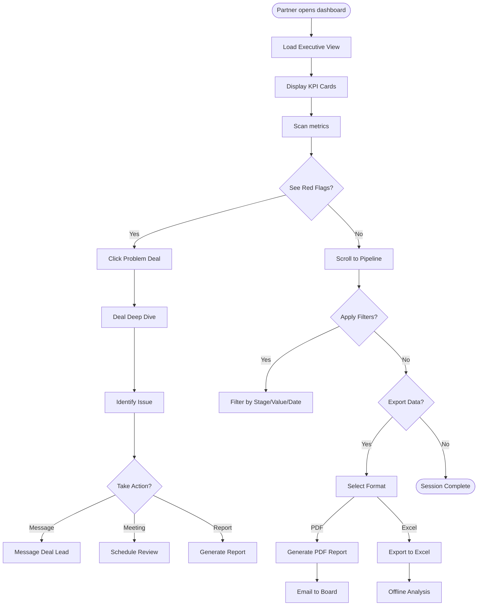
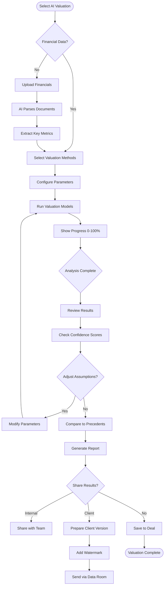
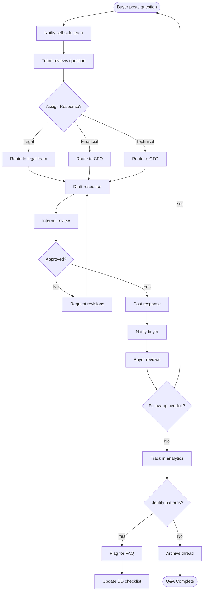

# 100 Days and Beyond - M&A Ecosystem Platform UX/UI Specification

_Generated on 2025-10-11 by BMad User_

## Executive Summary

The M&A Ecosystem Platform requires a sophisticated, professional interface that serves three distinct user personas: M&A Advisors (primary users managing deals), Deal Team Members (collaborating on transactions), and Firm Partners (requiring executive oversight). The UX must balance information density for power users with intuitive navigation for occasional users, while maintaining bank-grade credibility throughout.

This specification defines a deal-centric interface architecture with dashboard-driven navigation, real-time collaboration features, and AI-augmented workflows. The design emphasizes efficiency for high-stakes M&A transactions where every second counts and errors have significant financial implications. The platform will use a professional design system with sophisticated color palettes, dense information layouts, and keyboard-first interactions for power users.

**Project Scope:**

- 20 Functional Requirements across 4 major feature areas
- 3 Primary user personas with distinct needs
- Web-first platform with mobile companion capabilities
- High interaction complexity with AI integration
- Enterprise-grade security and compliance requirements

---

## 1. UX Goals and Principles

### 1.1 Target User Personas

**Primary Persona: M&A Advisor (Sarah)**

- **Role:** Independent M&A advisor or boutique firm professional
- **Experience:** 5-15 years in M&A, managing 3-10 active deals
- **Goals:** Close deals faster, maintain professional credibility, reduce admin time
- **Pain Points:** Fragmented tools, manual data entry, expensive enterprise software
- **Tech Savviness:** High - comfortable with Excel, financial tools, shortcuts
- **Usage Pattern:** Daily power user, 4-6 hours per day in platform
- **Key Features:** Pipeline management, AI valuations, document management, deal matching

**Secondary Persona: Deal Team Member (Alex)**

- **Role:** Associate or analyst supporting multiple deals
- **Experience:** 1-5 years, learning industry best practices
- **Goals:** Complete tasks efficiently, learn from senior team, avoid mistakes
- **Pain Points:** Information scattered, unclear priorities, version control issues
- **Tech Savviness:** Medium-High - digital native but new to M&A tools
- **Usage Pattern:** Daily collaborative user, task-focused
- **Key Features:** Task management, document collaboration, due diligence checklists

**Tertiary Persona: Firm Partner (James)**

- **Role:** Managing partner or executive with oversight responsibilities
- **Experience:** 15+ years, strategic focus
- **Goals:** Portfolio oversight, risk assessment, team performance monitoring
- **Pain Points:** Lack of real-time visibility, too much detail, report generation time
- **Tech Savviness:** Medium - expects intuitive interfaces
- **Usage Pattern:** Weekly dashboard reviews, monthly deep dives
- **Key Features:** Executive dashboards, portfolio analytics, automated reports

### 1.2 Usability Goals

**Primary Goals:**

1. **Efficiency:** Complete common tasks in <3 clicks, keyboard shortcuts for all major actions
2. **Learnability:** New users productive within 10 minutes without training
3. **Error Prevention:** Confirmation for destructive actions, auto-save every 30 seconds
4. **Flexibility:** Customizable workflows to match firm-specific processes
5. **Trust:** Bank-grade security visible, audit trails accessible, data integrity assured

**Performance Targets:**

- Page load: <2 seconds
- Search results: <500ms
- File upload: 10MB/second
- Auto-save: Every 30 seconds
- Keyboard navigation: 100% coverage

**Accessibility Requirements:**

- WCAG 2.1 AA compliance
- Full keyboard navigation
- Screen reader optimization
- High contrast mode
- Minimum touch target: 44x44px

### 1.3 Design Principles

**1. Professional Credibility First**
Every pixel reinforces trust. Use sophisticated color palettes (navy, charcoal, white), precise typography (Inter, SF Pro), and dense information layouts that respect users' expertise.

**2. Deal-Centric Architecture**
All navigation and actions center around the deal context. Persistent deal switcher, contextual actions based on deal stage, and smart defaults based on deal type.

**3. Progressive Information Density**
Show 80% of needed information immediately on desktop, with advanced options one click away. Mobile shows essential actions only.

**4. Intelligent Augmentation**
AI enhances but never replaces human judgment. Show confidence scores, explain reasoning, allow overrides, maintain audit trails.

**5. Collaborative Transparency**
Real-time presence indicators, activity feeds, version control, and clear ownership. Users always know who's doing what.

**6. Keyboard-First Power Use**
Comprehensive shortcuts (Cmd+K for command palette), Vim-style navigation option, Tab through all forms, bulk operations with Shift+Click.

**7. Performance as Trust**
Speed equals credibility. Instant feedback (<100ms), parallel loading, offline capability for critical features.

**8. Flexible Rigidity**
Customizable within guardrails. Allow pipeline customization but enforce security. Enable personal preferences but maintain team consistency.

---

## 2. Information Architecture

### 2.1 Site Map

```
Root
├── Auth
│   ├── Login (SSO + Email)
│   ├── Register (with subscription tier)
│   ├── Onboarding Wizard
│   └── Password Reset
├── Dashboard (role-adaptive)
│   ├── M&A Advisor Dashboard
│   ├── Deal Team Dashboard
│   └── Executive Dashboard
├── Deals
│   ├── Pipeline View (Kanban/List/Calendar)
│   ├── Deal Workspace
│   │   ├── Overview & Summary
│   │   ├── Parties & Contacts
│   │   ├── Financials & Valuation
│   │   ├── Documents & Data Room
│   │   ├── Tasks & Milestones
│   │   ├── Timeline & Activity
│   │   ├── Analytics & Reports
│   │   └── Team & Permissions
│   ├── Create New Deal
│   ├── Import Deals (Excel/CSV)
│   └── Deal Templates
├── Data Rooms
│   ├── Active Data Rooms
│   ├── Room Management
│   │   ├── Files & Folders
│   │   ├── Access Permissions
│   │   ├── Activity Monitoring
│   │   ├── Q&A Management
│   │   └── Watermark Settings
│   └── Create Data Room
├── AI Intelligence
│   ├── Valuation Engine
│   ├── Due Diligence Assistant
│   ├── Risk Assessment
│   ├── Document Analyzer
│   └── Deal Matching
├── Marketplace
│   ├── Browse Opportunities
│   ├── My Listings
│   ├── Saved Searches
│   ├── Connections
│   └── NDA Management
├── Community
│   ├── Discussion Forums
│   ├── Knowledge Base
│   ├── Templates Library
│   ├── Events Calendar
│   └── Expert Directory
├── Analytics
│   ├── Pipeline Analytics
│   ├── Portfolio Performance
│   ├── Team Metrics
│   ├── Custom Dashboards
│   └── Report Builder
└── Settings
    ├── Profile & Preferences
    ├── Team Management
    ├── Integrations
    ├── Subscription & Billing
    ├── Security & 2FA
    └── API Keys

### 2.2 Navigation Structure

**Primary Navigation Hierarchy:**

```

┌─────────────────────────────────────────────────────────────┐
│ Top Bar (Persistent Across All Pages) │
├─────────────────────────────────────────────────────────────┤
│ [Logo] [Deal Switcher ▼] [Search] [Cmd+K] [🔔] [User ▼] │
└─────────────────────────────────────────────────────────────┘

┌──────────────┬──────────────────────────────────────────────┐
│ Left Sidebar │ Main Content Area │
│ (Collapsible)│ │
├──────────────┤ │
│ ◉ Dashboard │ ┌──────────────────────────────────────┐ │
│ ○ Pipeline │ │ Contextual Action Bar │ │
│ ▼ Active Deal│ │ [Stage] [Actions] [Share] [AI] │ │
│ Overview │ └──────────────────────────────────────┘ │
│ Data Room │ │
│ Tasks │ ┌──────────────────────────────────────┐ │
│ Analytics │ │ │ │
│ Team │ │ Dynamic Content Area │ │
│ ○ Marketplace│ │ │ │
│ ○ Community │ │ │ │
│ ○ Reports │ └──────────────────────────────────────┘ │
│ ○ Settings │ │
└──────────────┴──────────────────────────────────────────────┘

```

**Navigation Components:**

1. **Persistent Top Bar:**
   - Logo: Return to dashboard
   - Deal Switcher: Quick access to recent/pinned deals with search
   - Global Search: Universal search across all content
   - Command Palette: Keyboard-driven navigation (Cmd+K)
   - Notifications: Real-time alerts with filtering
   - User Menu: Profile, preferences, logout

2. **Adaptive Left Sidebar:**
   - Collapsible for full-screen work
   - Icons + labels (icons only when collapsed)
   - Active deal context expands to show sub-navigation
   - Visual indicators for active section
   - Customizable shortcuts section

3. **Contextual Action Bar:**
   - Changes based on current view
   - Deal stage progression indicator
   - Quick actions relevant to current context
   - Collaboration tools (share, comment, assign)
   - AI assistant toggle for current view

4. **Breadcrumb Navigation:**
   - Shows hierarchy: Dashboard > Deals > Acme Acquisition > Documents
   - Clickable for quick navigation up the tree
   - Includes deal name for context persistence

**Mobile Navigation Strategy:**

```

┌─────────────────────────────┐
│ [☰] Logo [Search] [🔔] [User]│ <- Simplified top bar
├─────────────────────────────┤
│ [Current Deal Name ▼] │ <- Deal context
├─────────────────────────────┤
│ │
│ Content Area │ <- Full screen content
│ │
├─────────────────────────────┤
│ [Home][Deals][+][Tasks][More]│ <- Bottom tab bar
└─────────────────────────────┘

````

**Keyboard Navigation Map:**
- `Cmd+K`: Command palette
- `Cmd+/`: Search
- `Cmd+D`: Deal switcher
- `Cmd+N`: New deal
- `G then D`: Go to dashboard
- `G then P`: Go to pipeline
- `G then T`: Go to tasks
- `Tab`: Navigate forward
- `Shift+Tab`: Navigate backward
- `Esc`: Close modals/return to parent

---

## 3. User Flows

### Flow 1: Deal Creation to Pipeline Management (M&A Advisor)

**User Goal:** Create a new sell-side mandate and set up for buyer outreach

**Entry Points:** Dashboard quick action, Pipeline "+" button, Cmd+N

```mermaid
flowchart TD
    Start([Advisor clicks New Deal]) --> Type{Select Deal Type}
    Type -->|Sell-side| SellForm[Complete Sell-side Form]
    Type -->|Buy-side| BuyForm[Complete Buy-side Form]

    SellForm --> Validate{Validate Required Fields}
    BuyForm --> Validate

    Validate -->|Invalid| Error[Show inline errors]
    Error --> SellForm

    Validate -->|Valid| Create[Create Deal + Generate ID]
    Create --> Upload{Upload Documents?}

    Upload -->|Yes| DragDrop[Drag & Drop Interface]
    Upload -->|Skip| Pipeline

    DragDrop --> AI[AI Document Analysis]
    AI --> Categorize[Auto-categorize files]
    Categorize --> Pipeline[Add to Pipeline]

    Pipeline --> Position[Position in Stage 1]
    Position --> Notify[Notify team members]
    Notify --> Success([Deal Ready for Work])
````

**Key Decision Points:**

- Deal type selection determines form fields
- Document upload triggers AI analysis
- Team notification preferences

**Success Criteria:** Deal visible in pipeline within 30 seconds

### Flow 2: Due Diligence Document Review (Deal Team Member)

**User Goal:** Review and process due diligence documents efficiently

**Entry Points:** Task notification, Deal workspace, Email link

```mermaid
flowchart TD
    Start([Team member receives DD task]) --> Access[Open Deal Workspace]
    Access --> Navigate[Navigate to Data Room]
    Navigate --> View{View Mode?}

    View -->|List| ListView[Document List View]
    View -->|Grid| GridView[Thumbnail Grid]

    ListView --> Select[Select Document]
    GridView --> Select

    Select --> Preview[Preview Panel Opens]
    Preview --> Actions{Choose Action}

    Actions -->|Review| Annotate[Add Comments/Annotations]
    Actions -->|Download| Permission{Has Permission?}
    Actions -->|Share| ShareDialog[Share Settings]

    Permission -->|Yes| Download[Download with watermark]
    Permission -->|No| RequestAccess[Request Access]

    Annotate --> Flag{Flag Issues?}
    Flag -->|Yes| CreateTask[Create Follow-up Task]
    Flag -->|No| MarkReviewed[Mark as Reviewed]

    CreateTask --> Assign[Assign to Team Member]
    MarkReviewed --> Next{More Documents?}

    Next -->|Yes| Select
    Next -->|No| Complete([Task Complete])
```

**Error States:**

- No permission: Show request access flow
- Document locked: Show who's editing
- Upload failed: Retry with resume

### Flow 3: Executive Dashboard Review (Firm Partner)

**User Goal:** Get portfolio overview and drill into problem deals

**Entry Points:** Weekly email, Dashboard bookmark, Mobile app



**Key Metrics Shown:**

- Total deal value
- Pipeline conversion rate
- Average deal velocity
- Team utilization
- At-risk deals

### Flow 4: AI Valuation Workflow (M&A Advisor)

**User Goal:** Get AI-powered valuation for a potential acquisition

**Entry Points:** Deal workspace, AI tools menu, Quick action



**AI Features:**

- Confidence scores for each method
- Explanation of calculations
- Sensitivity analysis
- Comparable transactions

### Flow 5: Deal Room Collaboration (Multi-party)

**User Goal:** Manage Q&A during due diligence with multiple parties

**Entry Points:** Data room Q&A section, Email notification, Task list



**Collaboration Features:**

- Real-time notifications
- Thread management
- Version tracking
- Response templates
- Analytics on Q&A patterns

---

## 4. Component Library and Design System

### 4.1 Design System Approach

**Hybrid Strategy: Material UI Foundation + Custom M&A Components**

We will leverage Material UI (MUI) v5 as the foundation for standard components (buttons, forms, modals) while building custom components for M&A-specific workflows. This approach balances development speed with domain-specific requirements.

**Component Architecture:**

- **Base Layer:** MUI components with custom theme
- **Domain Layer:** M&A-specific composite components
- **Pattern Layer:** Reusable workflow patterns
- **Template Layer:** Page-level compositions

**Development Principles:**

- All components must support keyboard navigation
- Components expose loading, error, and empty states
- Built-in accessibility with ARIA labels
- Responsive by default with mobile variants
- TypeScript interfaces for all props

### 4.2 Core Components

#### Deal Management Components

**DealCard**

```typescript
interface DealCardProps {
  view: 'compact' | 'expanded' | 'minimal';
  deal: Deal;
  actions?: ActionItem[];
  draggable?: boolean;
  onClick?: () => void;
}
```

States: Default, Hover, Active, Dragging, Selected
Variants: Sell-side (blue), Buy-side (green), Neutral (gray)

**PipelineColumn**

- Droppable container for deal cards
- Stage header with count and value
- Collapse/expand functionality
- Quick add deal button
- Bulk actions toolbar

**StageProgressBar**

```
[Sourcing]-->[Initial Contact]-->[Due Diligence]-->[Negotiation]-->[Closing]
    ✓             ✓                  ●              ○            ○
```

Visual indicator of deal progression with clickable stages

#### Data Visualization Components

**KPICard**

```typescript
interface KPICardProps {
  title: string;
  value: string | number;
  change?: number;
  trend?: 'up' | 'down' | 'stable';
  sparkline?: number[];
  onClick?: () => void;
}
```

Displays: Main metric, percentage change, trend arrow, mini chart

**DealFunnel**

- Interactive funnel visualization
- Click to filter pipeline
- Hover for stage details
- Conversion rates between stages

**ValueHeatMap**

- Grid view of deals by value/priority
- Color intensity indicates value
- Click for quick preview
- Customizable axes

#### Document Components

**FileDropZone**

```typescript
interface FileDropZoneProps {
  accept?: string[];
  maxSize?: number;
  maxFiles?: number;
  onUpload: (files: File[]) => void;
  processing?: boolean;
}
```

Features: Drag indicator, progress bars, file type icons, cancel upload

**DocumentPreview**

- In-modal document viewer
- Annotation tools
- Download/print controls
- Navigation between documents
- Full-screen toggle

**PermissionGrid**

```
         | View | Download | Edit | Delete |
User A   |  ✓   |    ✓    |  ✓   |   ×   |
User B   |  ✓   |    ×    |  ×   |   ×   |
```

Interactive permission matrix with bulk edit

#### AI Components

**AIConfidenceBar**

```
Confidence: [████████░░] 82%
           Low    Med   High
```

Visual representation of AI confidence with tooltip explanation

**AISuggestionCard**

```typescript
interface AISuggestionProps {
  suggestion: string;
  confidence: number;
  reasoning?: string;
  actions: Array<'accept' | 'reject' | 'modify'>;
}
```

Displays AI recommendation with accept/reject/modify actions

**AIExplainPanel**

- Collapsible explanation panel
- Step-by-step reasoning
- Source data references
- Confidence breakdown

#### Form Components

**DealForm**

- Multi-step wizard for complex deals
- Conditional fields based on deal type
- Auto-save indicator
- Validation in real-time
- Field help tooltips

**QuickSearch**

```typescript
interface QuickSearchProps {
  placeholder?: string;
  filters?: FilterOption[];
  onSearch: (query: string, filters: Filter[]) => void;
  suggestions?: boolean;
}
```

Global search with type-ahead and filter pills

**FilterBuilder**

- Visual query builder
- AND/OR logic groups
- Saved filter sets
- Quick filter chips

#### Navigation Components

**DealSwitcher**

```typescript
interface DealSwitcherProps {
  currentDeal?: Deal;
  recentDeals: Deal[];
  pinnedDeals?: Deal[];
  onSwitch: (deal: Deal) => void;
}
```

Dropdown with search, recent, and pinned deals

**CommandPalette**

- Keyboard-driven navigation
- Fuzzy search commands
- Recent actions
- Context-aware suggestions

**BreadcrumbNav**

```
Dashboard > Deals > Acme Acquisition > Documents > Q3 Financials
```

Clickable breadcrumb with overflow handling

#### Collaboration Components

**PresenceIndicator**

```typescript
interface PresenceProps {
  users: User[];
  maxDisplay?: number;
  showNames?: boolean;
}
```

Shows active users with avatars and status

**CommentThread**

- Threaded discussions
- @mentions with autocomplete
- Rich text formatting
- Attachments support
- Read indicators

**ActivityFeed**

- Chronological activity stream
- Filterable by type/user
- Expandable details
- Quick actions

#### Table Components

**DataTable**

```typescript
interface DataTableProps {
  columns: Column[];
  data: any[];
  sortable?: boolean;
  selectable?: boolean;
  pagination?: PaginationConfig;
  actions?: ActionConfig;
}
```

Features: Sort, filter, select, bulk actions, export, column resize

**ComparisonTable**

- Side-by-side comparison
- Highlight differences
- Synchronized scrolling
- Export comparison

---

## 5. Visual Design Foundation

### 5.1 Color Palette

**Primary Colors**

```css
--primary-900: #0a1628; /* Deep Navy - Headers, primary text */
--primary-700: #1e3a5f; /* Navy - Primary buttons, links */
--primary-500: #2e5c8a; /* Medium Blue - Active states */
--primary-300: #5b8fbc; /* Light Blue - Hover states */
--primary-100: #e8f1fa; /* Pale Blue - Backgrounds */
```

**Semantic Colors**

```css
--success-600: #059669; /* Green - Positive metrics, completed */
--warning-600: #d97706; /* Amber - Warnings, pending */
--error-600: #dc2626; /* Red - Errors, declined */
--info-600: #2563eb; /* Blue - Information, notifications */
```

**Neutral Palette**

```css
--gray-900: #111827; /* Near Black - Primary text */
--gray-700: #374151; /* Dark Gray - Secondary text */
--gray-500: #6b7280; /* Medium Gray - Muted text */
--gray-300: #d1d5db; /* Light Gray - Borders */
--gray-100: #f3f4f6; /* Off White - Backgrounds */
--white: #ffffff; /* Pure White - Cards, modals */
```

**Deal Type Colors**

```css
--sell-side: #2563eb; /* Blue - Sell-side deals */
--buy-side: #059669; /* Green - Buy-side deals */
--portfolio: #7c3aed; /* Purple - Portfolio companies */
--mandate: #dc2626; /* Red - Urgent mandates */
```

**Data Visualization Palette**

```css
--chart-1: #2e5c8a; /* Primary Blue */
--chart-2: #059669; /* Success Green */
--chart-3: #7c3aed; /* Purple */
--chart-4: #dc2626; /* Red */
--chart-5: #d97706; /* Amber */
--chart-6: #0891b2; /* Cyan */
```

### 5.2 Typography

**Font Families:**

```css
--font-primary: 'Inter', -apple-system, BlinkMacSystemFont, 'Segoe UI', sans-serif;
--font-mono: 'SF Mono', 'Monaco', 'Inconsolata', 'Fira Code', monospace;
--font-display: 'Inter', sans-serif; /* For headings */
```

**Type Scale:**

```css
/* Desktop Type Scale (rem units) */
--text-xs: 0.75rem; /* 12px - Captions, labels */
--text-sm: 0.875rem; /* 14px - Body small, help text */
--text-base: 1rem; /* 16px - Body text */
--text-lg: 1.125rem; /* 18px - Body large */
--text-xl: 1.25rem; /* 20px - H6 */
--text-2xl: 1.5rem; /* 24px - H5 */
--text-3xl: 1.875rem; /* 30px - H4 */
--text-4xl: 2.25rem; /* 36px - H3 */
--text-5xl: 3rem; /* 48px - H2 */
--text-6xl: 3.75rem; /* 60px - H1 (rarely used) */

/* Line Heights */
--leading-tight: 1.25; /* Headlines */
--leading-normal: 1.5; /* Body text */
--leading-relaxed: 1.75; /* Readable paragraphs */

/* Font Weights */
--font-normal: 400; /* Body text */
--font-medium: 500; /* Emphasized text */
--font-semibold: 600; /* Buttons, labels */
--font-bold: 700; /* Headings */

/* Letter Spacing */
--tracking-tight: -0.025em; /* Headlines */
--tracking-normal: 0; /* Body */
--tracking-wide: 0.025em; /* Caps, labels */
```

### 5.3 Spacing and Layout

**Spacing Scale (8px base)**

```css
--space-0: 0; /* 0px */
--space-1: 0.25rem; /* 4px */
--space-2: 0.5rem; /* 8px - Base unit */
--space-3: 0.75rem; /* 12px */
--space-4: 1rem; /* 16px */
--space-5: 1.25rem; /* 20px */
--space-6: 1.5rem; /* 24px */
--space-8: 2rem; /* 32px */
--space-10: 2.5rem; /* 40px */
--space-12: 3rem; /* 48px */
--space-16: 4rem; /* 64px */
--space-20: 5rem; /* 80px */
--space-24: 6rem; /* 96px */
```

**Layout Grid**

```css
/* Container Widths */
--container-xs: 20rem; /* 320px - Mobile */
--container-sm: 24rem; /* 384px - Mobile large */
--container-md: 28rem; /* 448px - Tablet */
--container-lg: 32rem; /* 512px - Desktop small */
--container-xl: 36rem; /* 576px - Desktop */
--container-2xl: 42rem; /* 672px - Desktop large */
--container-3xl: 48rem; /* 768px - Wide */
--container-4xl: 56rem; /* 896px - Extra wide */
--container-5xl: 64rem; /* 1024px - Full */
--container-6xl: 72rem; /* 1152px - Maximum */
--container-full: 100%; /* Full width */

/* Grid System */
--grid-cols: 12; /* 12-column grid */
--grid-gap: var(--space-4); /* 16px gutter */

/* Common Layouts */
.sidebar-layout {
  grid-template-columns: 240px 1fr; /* Fixed sidebar + fluid content */
}

.dashboard-grid {
  grid-template-columns: repeat(auto-fit, minmax(300px, 1fr));
  gap: var(--space-6);
}

.card-grid {
  display: grid;
  grid-template-columns: repeat(auto-fill, minmax(280px, 1fr));
  gap: var(--space-4);
}
```

**Border Radius**

```css
--radius-sm: 0.125rem; /* 2px - Small elements */
--radius-md: 0.375rem; /* 6px - Default */
--radius-lg: 0.5rem; /* 8px - Cards */
--radius-xl: 0.75rem; /* 12px - Modals */
--radius-2xl: 1rem; /* 16px - Large cards */
--radius-full: 9999px; /* Pills, avatars */
```

**Shadows**

```css
--shadow-xs: 0 1px 2px 0 rgba(0, 0, 0, 0.05);
--shadow-sm: 0 1px 3px 0 rgba(0, 0, 0, 0.1);
--shadow-md: 0 4px 6px -1px rgba(0, 0, 0, 0.1);
--shadow-lg: 0 10px 15px -3px rgba(0, 0, 0, 0.1);
--shadow-xl: 0 20px 25px -5px rgba(0, 0, 0, 0.1);
--shadow-2xl: 0 25px 50px -12px rgba(0, 0, 0, 0.25);
--shadow-inner: inset 0 2px 4px 0 rgba(0, 0, 0, 0.06);
```

**Z-Index Layers**

```css
--z-dropdown: 1000; /* Dropdowns */
--z-sticky: 1020; /* Sticky elements */
--z-fixed: 1030; /* Fixed headers */
--z-modal-backdrop: 1040; /* Modal backdrop */
--z-modal: 1050; /* Modals */
--z-popover: 1060; /* Popovers */
--z-tooltip: 1070; /* Tooltips */
--z-notification: 1080; /* Toast notifications */
```

---

## 6. Responsive Design

### 6.1 Breakpoints

```css
/* Mobile First Breakpoint System */
--breakpoint-sm: 640px; /* Small tablets, large phones landscape */
--breakpoint-md: 768px; /* Tablets */
--breakpoint-lg: 1024px; /* Desktop */
--breakpoint-xl: 1280px; /* Large desktop */
--breakpoint-2xl: 1536px; /* Extra large screens */

/* Media Query Usage */
@media (min-width: 640px) {
  /* sm */
}
@media (min-width: 768px) {
  /* md */
}
@media (min-width: 1024px) {
  /* lg */
}
@media (min-width: 1280px) {
  /* xl */
}
@media (min-width: 1536px) {
  /* 2xl */
}
```

**Device Targets:**

- **Mobile (default):** 320px - 639px
- **Tablet:** 640px - 1023px
- **Desktop:** 1024px - 1279px
- **Large Desktop:** 1280px+

### 6.2 Adaptation Patterns

**Navigation Transformation**

```
Desktop (>1024px):        Tablet (768-1023px):      Mobile (<768px):
┌──────┬──────────┐      ┌─────────────────┐      ┌─────────────┐
│Side- │ Content  │      │ Top Nav         │      │ ☰ Hamburger │
│bar   │          │  =>  ├─────────────────┤  =>  ├─────────────┤
│      │          │      │ Content         │      │ Content     │
└──────┴──────────┘      └─────────────────┘      └─────────────┘
                                                   └─Bottom Tabs─┘
```

**Content Reflow Patterns**

**Dashboard Grid:**

- Desktop: 4 columns
- Tablet: 2 columns
- Mobile: 1 column (stacked)

**Deal Cards:**

- Desktop: Full information visible
- Tablet: Secondary info on hover
- Mobile: Primary info only, tap for details

**Tables to Cards:**

```
Desktop: Traditional table with all columns
Tablet: Hide secondary columns, add row actions
Mobile: Transform to stacked cards with key data
```

**Form Adaptations:**

- Desktop: Multi-column forms, side-by-side fields
- Tablet: Single column with grouped sections
- Mobile: Single column, full-width fields, stepped wizard

**Modal Sizing:**

```css
/* Desktop */
.modal {
  max-width: 600px;
  margin: 80px auto;
}

/* Tablet */
@media (max-width: 768px) {
  .modal {
    max-width: 90%;
    margin: 40px auto;
  }
}

/* Mobile */
@media (max-width: 640px) {
  .modal {
    max-width: 100%;
    height: 100%;
    margin: 0;
    border-radius: 0;
  }
}
```

**Touch Target Adjustments:**

- Desktop: Standard 36px click targets
- Touch devices: Minimum 44px tap targets
- Spacing increases by 1.5x on mobile

---

## 7. Accessibility

### 7.1 Compliance Target

**WCAG 2.1 Level AA Compliance**

We commit to meeting Web Content Accessibility Guidelines 2.1 Level AA standards, ensuring the platform is usable by people with diverse abilities including:

- Visual impairments (screen readers, low vision)
- Motor impairments (keyboard-only navigation)
- Cognitive differences (clear language, consistent navigation)
- Hearing impairments (captions for video content)

**Legal Compliance:**

- UK Equality Act 2010
- EU Web Accessibility Directive
- Americans with Disabilities Act (for US expansion)

### 7.2 Key Requirements

**Visual Accessibility**

1. **Color Contrast Ratios:**
   - Normal text: 4.5:1 minimum
   - Large text (18pt+): 3:1 minimum
   - Interactive elements: 3:1 minimum
   - Focus indicators: 3:1 against all backgrounds

2. **Visual Indicators:**
   - Never rely on color alone
   - Icons accompany color coding
   - Patterns for data visualization
   - Clear focus states (2px minimum outline)

3. **Text and Fonts:**
   - Minimum 14px font size
   - User-adjustable up to 200% zoom
   - Line height minimum 1.5x
   - No text in images (except logos)

**Keyboard Navigation**

1. **Full Keyboard Access:**

   ```
   Tab: Forward navigation
   Shift+Tab: Backward navigation
   Enter: Activate buttons/links
   Space: Toggle checkboxes, buttons
   Arrow keys: Navigate within components
   Escape: Close modals/menus
   ```

2. **Focus Management:**
   - Visible focus indicator at all times
   - Logical tab order (left-to-right, top-to-bottom)
   - Focus trap in modals
   - Skip links for main content
   - Focus restoration after modal close

3. **Keyboard Shortcuts:**
   - All shortcuts have visual indicators
   - Can be disabled/customized
   - Don't conflict with screen readers
   - Documented in help section

**Screen Reader Support**

1. **Semantic HTML:**

   ```html
   <nav aria-label="Main navigation">
     <main role="main">
       <aside aria-label="Deal information">
         <button aria-pressed="true">
           
         </button>
       </aside>
     </main>
   </nav>
   ```

2. **ARIA Implementation:**
   - Proper roles for custom components
   - aria-label for icon buttons
   - aria-describedby for help text
   - aria-live regions for updates
   - aria-expanded for collapsibles

3. **Content Structure:**
   - Heading hierarchy (h1 → h6)
   - Lists for grouped items
   - Tables with headers and captions
   - Landmark regions

**Forms and Errors**

1. **Form Accessibility:**
   - Labels for all inputs
   - Required field indicators
   - Fieldsets for grouped inputs
   - Clear instructions
   - Error messages associated with fields

2. **Error Handling:**

   ```html
   <input aria-invalid="true" aria-describedby="email-error" />
   <span id="email-error" role="alert"> Email format is invalid </span>
   ```

3. **Validation Feedback:**
   - Inline validation messages
   - Summary of errors at top
   - Focus moves to first error
   - Success confirmations

**Motion and Animation**

1. **Reduced Motion Support:**

   ```css
   @media (prefers-reduced-motion: reduce) {
     * {
       animation-duration: 0.01ms !important;
     }
   }
   ```

2. **Animation Controls:**
   - Pause auto-playing content
   - No flashing >3 times/second
   - Smooth scrolling optional
   - Progress indicators for long processes

**Content Accessibility**

1. **Language and Readability:**
   - Clear, simple language
   - Avoid jargon (or explain it)
   - Consistent terminology
   - Error messages explain how to fix

2. **Time Limits:**
   - Warning before timeout
   - Option to extend time
   - Save progress capability
   - No time limits on reading

3. **Help and Documentation:**
   - Contextual help available
   - Accessible documentation
   - Video captions/transcripts
   - Alternative contact methods

**Testing Requirements**

1. **Automated Testing:**
   - axe-core integration
   - Lighthouse CI checks
   - ESLint accessibility rules
   - Unit tests for ARIA

2. **Manual Testing:**
   - Keyboard-only navigation
   - Screen reader testing (NVDA, JAWS)
   - Color contrast verification
   - Zoom to 200% functionality

3. **User Testing:**
   - Include users with disabilities
   - Assistive technology testing
   - Regular accessibility audits
   - Feedback mechanism for issues

---

## 8. Interaction and Motion

### 8.1 Motion Principles

**Purposeful and Professional**
Motion enhances usability without distraction. Every animation serves a purpose: providing feedback, maintaining context, or guiding attention. Professional users value efficiency over delight.

**Motion Principles:**

1. **Swift and Responsive:** 200-300ms for most transitions
2. **Natural Easing:** ease-in-out for smooth, professional feel
3. **Contextual Continuity:** Elements transform rather than appear/disappear
4. **Reduced Motion Respect:** Full respect for prefers-reduced-motion
5. **Performance First:** GPU-accelerated transforms only

### 8.2 Key Animations

**Micro-interactions**

```css
/* Button Press */
.button {
  transition: all 200ms ease-in-out;
  transform: translateY(0);
}
.button:active {
  transform: translateY(1px);
  box-shadow: var(--shadow-sm);
}

/* Card Hover */
.deal-card {
  transition:
    transform 200ms ease-out,
    box-shadow 200ms ease-out;
}
.deal-card:hover {
  transform: translateY(-2px);
  box-shadow: var(--shadow-lg);
}
```

**Page Transitions**

1. **Slide Transitions:** 300ms lateral slide for navigation
2. **Fade In:** 200ms fade for content loading
3. **Expand/Collapse:** 250ms accordion for sections
4. **Modal Entry:** 200ms fade backdrop, 250ms scale content

**Loading States**

```css
/* Skeleton Loading */
@keyframes shimmer {
  0% {
    background-position: -200% 0;
  }
  100% {
    background-position: 200% 0;
  }
}

.skeleton {
  background: linear-gradient(90deg, var(--gray-200) 25%, var(--gray-100) 50%, var(--gray-200) 75%);
  background-size: 200% 100%;
  animation: shimmer 1.5s infinite;
}
```

**Progress Indicators**

- File uploads: Real-time progress bar
- AI analysis: Stepped progress with descriptions
- Page loads: Top-line progress indicator
- Background tasks: Subtle badge animation

**Drag and Drop**

```css
.dragging {
  opacity: 0.5;
  transform: rotate(2deg);
}
.drag-over {
  background: var(--primary-100);
  border: 2px dashed var(--primary-500);
}
```

---

## 9. Design Files and Wireframes

### 9.1 Design Files

**Design System Documentation**

- Location: `[To be created in Figma]`
- Structure: Atomic design methodology
- Components: Fully documented with states
- Handoff: Dev mode enabled with CSS variables

**Key Design Files:**

1. **Component Library:** All components with variants
2. **Page Templates:** Major page layouts
3. **User Flows:** Interactive prototypes
4. **Design Tokens:** Exported as JSON

### 9.2 Key Screen Layouts

**Dashboard Layout (Desktop)**

```
┌─────────────────────────────────────────────────────┐
│ Top Bar                                    User ▼   │
├───────────┬─────────────────────────────────────────┤
│           │ Welcome back, Sarah                     │
│           │ ┌──────┐ ┌──────┐ ┌──────┐ ┌──────┐  │
│ Sidebar   │ │ KPI  │ │ KPI  │ │ KPI  │ │ KPI  │  │
│           │ └──────┘ └──────┘ └──────┘ └──────┘  │
│           ├─────────────────────────────────────────┤
│           │ Active Deals Pipeline                   │
│           │ ┌─────┬─────┬─────┬─────┬─────┐       │
│           │ │     │     │     │     │     │       │
│           │ │     │     │     │     │     │       │
│           │ └─────┴─────┴─────┴─────┴─────┘       │
│           ├─────────────────────────────────────────┤
│           │ Recent Activity    Quick Actions       │
└───────────┴─────────────────────────────────────────┘
```

**Deal Workspace (Desktop)**

```
┌─────────────────────────────────────────────────────┐
│ Breadcrumb > Deal Name            Share  AI  ⚙️     │
├───────────┬─────────────────────────────────────────┤
│ Deal Nav  │ Deal Header: $5M | Stage 3 | 75% prob  │
│ ○ Overview│ ┌────────────────┬───────────────────┐ │
│ ● Data    │ │                │  Quick Stats      │ │
│ ○ Tasks   │ │  Document      │  • Last Activity  │ │
│ ○ Team    │ │  Viewer        │  • Next Milestone │ │
│ ○ Notes   │ │                │  • Risk Score     │ │
│           │ └────────────────┴───────────────────┘ │
│           │ Activity Timeline                       │
└───────────┴─────────────────────────────────────────┘
```

**Mobile Deal View**

```
┌─────────────────┐
│ ← Deal Name  ⋮  │
├─────────────────┤
│ Stage Progress  │
│ ━━━━●━━━━       │
├─────────────────┤
│ $5M | 75% prob  │
├─────────────────┤
│ [Overview][Docs]│
│ [Tasks][Team]   │
├─────────────────┤
│ Key Metrics     │
│ • Valuation     │
│ • Due Date      │
│ • Risk Score    │
├─────────────────┤
│ Recent Activity │
│ ...             │
└─────────────────┘
```

---

## 10. Next Steps

### 10.1 Immediate Actions

1. **Create Figma Design System**
   - Set up component library with all defined components
   - Create color, typography, and spacing tokens
   - Build responsive component variants

2. **Develop Key Page Mockups**
   - Dashboard for each persona
   - Deal pipeline and workspace
   - Data room interface
   - AI analysis screens

3. **Frontend Architecture Setup**
   - Configure MUI theme with custom tokens
   - Set up component library structure
   - Implement responsive breakpoint system
   - Configure accessibility testing tools

4. **Prototype Critical Flows**
   - Deal creation flow
   - Document upload and review
   - AI valuation process
   - Executive dashboard drill-down

### 10.2 Design Handoff Checklist

**Design System**

- [x] Color palette defined with semantic meanings
- [x] Typography scale and font families specified
- [x] Spacing system and layout grid documented
- [x] Component specifications with states
- [x] Responsive breakpoints established

**User Experience**

- [x] User personas clearly defined
- [x] Information architecture mapped
- [x] Navigation patterns specified
- [x] User flows for critical paths
- [x] Accessibility requirements documented

**Visual Design**

- [x] Professional aesthetic aligned with M&A industry
- [x] Consistent design language established
- [x] Motion principles defined
- [ ] High-fidelity mockups created
- [ ] Interactive prototype available

**Development Readiness**

- [x] Component interfaces documented
- [x] Responsive patterns specified
- [x] Accessibility guidelines provided
- [x] Performance targets set
- [ ] Design tokens exported

**Next Workflow:** Execute `solution-architecture` workflow with this UX specification as input

---

## Appendix

### Related Documents

- PRD: `C:\Projects\ma-saas-platform\docs\PRD.md`
- Epics: `C:\Projects\ma-saas-platform\docs\epics.md`
- Tech Spec: `[To be created]`
- Architecture: `[To be created]`

### Version History

| Date       | Version | Changes               | Author    |
| ---------- | ------- | --------------------- | --------- |
| 2025-10-11 | 1.0     | Initial specification | BMad User |
