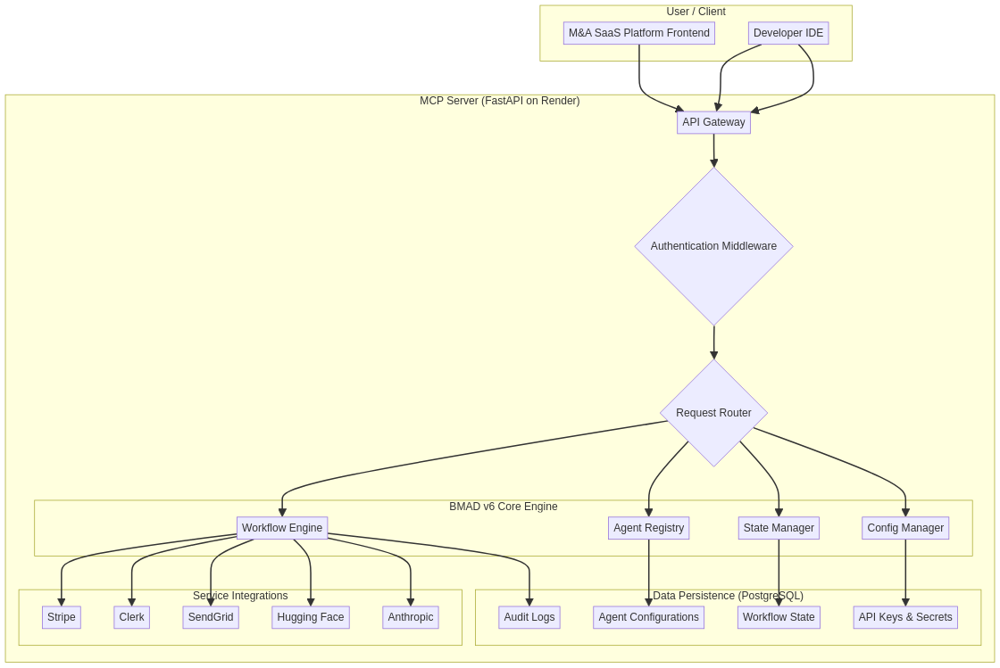

> # BMAD v6 MCP Server

**Version 1.0.0**

This repository contains the source code for the **BMAD v6 Model Context Protocol (MCP) Server**, a centralized service designed to orchestrate and manage development workflows for the multi-tenant M&A SaaS platform. It is built following the **BMAD-method v6 specifications**, providing a robust and scalable framework for AI-driven project management and implementation.

The MCP server acts as a central hub for coordinating AI agents, executing scale-adaptive workflows, and managing the state of M&A deal projects. It is designed to integrate seamlessly with the existing Render.com infrastructure, providing a powerful and flexible solution for accelerating development and achieving the long-term goal of £200M net worth.

## Key Features

- **BMAD v6 Compliance**: Fully implements the core principles of BMAD-method v6, including the Four-Phase Methodology, Scale-Adaptive Workflows, and Agent-as-Code patterns.
- **Centralized API Key Management**: Securely stores and manages API keys for all integrated services, providing a single source of truth and enhancing security.
- **AI Agent Orchestration**: Includes a registry of specialized AI agents (Orchestrator, Analyst, PM, Architect, Dev, M&A Specialist) that can be invoked to perform specific tasks.
- **Scale-Adaptive Workflow Engine**: Dynamically adjusts project workflows based on the assessed scale level (0-4), ensuring that the right level of process is applied for each project.
- **State Machine Management**: Implements the BMAD v6 state machine for tracking the progress of user stories from backlog to completion.
- **Integration Ready**: Designed to integrate with the existing M&A SaaS platform backend and frontend services, with endpoints for registration, status checking, and data migration.
- **Deployable on Render.com**: Includes a `render.yaml` file and `Dockerfile` for easy deployment to Render.com.

## Architecture Overview

The MCP server is built with FastAPI and is composed of several core services:

- **`main.py`**: The main application file, containing the FastAPI app, API endpoints, and startup logic.
- **`agent_registry.py`**: Manages the registration and invocation of BMAD v6 AI agents.
- **`workflow_engine.py`**: Orchestrates the execution of scale-adaptive workflows.
- **`security_manager.py`**: Handles API key management, authentication, and authorization.
- **`state_manager.py`**: Manages the state of projects and user stories.
- **`integration_service.py`**: Provides services for integrating the MCP server with the existing M&A platform.

For a visual representation of the architecture, please see the diagram below:



## Getting Started

### Prerequisites

- Python 3.11
- Docker
- Render CLI

### Local Development

1.  **Clone the repository:**

    ```bash
    git clone <repository-url>
    cd ma-saas-platform/mcp-server
    ```

2.  **Install dependencies:**

    ```bash
    pip install -r requirements.txt
    ```

3.  **Set up environment variables:**

    Create a `.env` file in the `mcp-server` directory and add the following:

    ```
    STRIPE_SECRET_KEY=your_stripe_secret_key
    CLERK_SECRET_KEY=your_clerk_secret_key
    SENDGRID_API_KEY=your_sendgrid_api_key
    HUGGINGFACE_API_KEY=your_huggingface_api_key
    ANTHROPIC_API_KEY=your_anthropic_api_key
    OPENAI_API_KEY=your_openai_api_key
    ```

4.  **Run the server:**

    ```bash
    uvicorn app.main:app --reload
    ```

The server will be available at `http://localhost:8000`.

### Docker

1.  **Build the Docker image:**

    ```bash
    docker build -t bmad-v6-mcp-server .
    ```

2.  **Run the Docker container:**

    ```bash
    docker run -d -p 8000:8000 --env-file .env bmad-v6-mcp-server
    ```

## API Documentation

The MCP server provides a comprehensive set of API endpoints for interacting with the various services. The full API documentation is available at `http://localhost:8000/docs` when the server is running.

### Example: Execute a Workflow

```bash
curl -X POST "http://localhost:8000/api/v1/workflow/execute" \
-H "Authorization: Bearer your_jwt_token" \
-H "Content-Type: application/json" \
-d '{ "workflow_name": "plan-project", "context": { "project_name": "New Deal", "estimated_stories": 15 }, "project_id": "new-deal-001" }'
```

## Deployment

The MCP server is designed for easy deployment to Render.com.

1.  **Create a new Blueprint Instance** on Render.com.
2.  **Connect the repository** containing the `mcp-server` directory.
3.  **Render will automatically detect the `render.yaml` file** and create the web service and database.
4.  **Set the environment variables** for the API keys in the Render dashboard.
5.  **The server will be deployed** and available at the URL provided by Render.

Alternatively, you can use the `deploy.sh` script to deploy from your local machine:

```bash
./deploy.sh
```

## Integration with M&A SaaS Platform

Once the MCP server is deployed, it can be integrated with the existing M&A SaaS platform services.

1.  **Register the MCP Server:**

    Call the `/api/v1/integration/register` endpoint on the MCP server. This will update the backend and frontend services to use the new MCP server URL.

2.  **Sync API Keys:**

    Call the `/api/v1/integration/sync-keys` endpoint to sync the API keys from the existing services to the MCP server.

3.  **Migrate Project State:**

    For existing projects, call the `/api/v1/integration/migrate-project/{project_id}` endpoint to migrate the project state to the BMAD v6 format.

## Codex Prompts

For examples of how to use the MCP server with OpenAI Codex, please see the `CODEX_PROMPTS.md` file.

